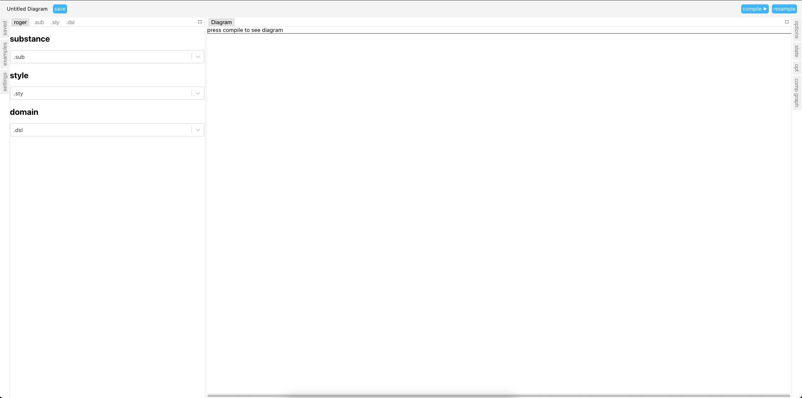
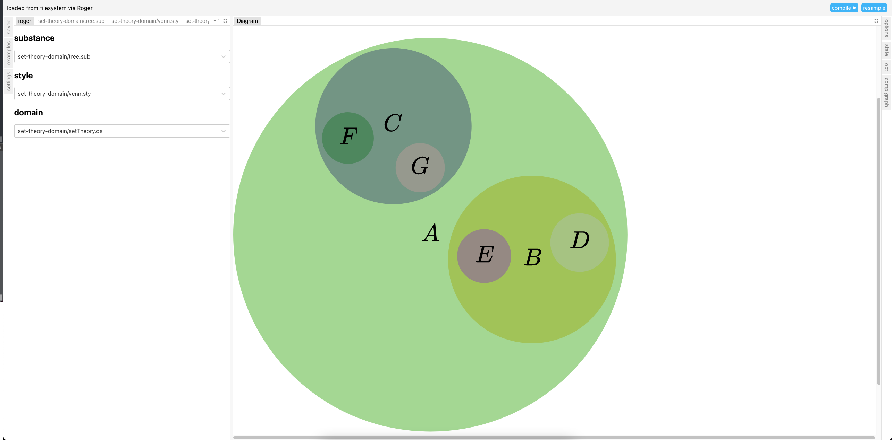

# Contributing to Penrose

<!-- toc -->

- [Prerequisites](#prerequisites)
  - [Apple Silicon](#apple-silicon)
  - [Windows WSL](#windows-wsl)
  - [Linux](#linux)
- [Setup](#setup)
- [Editor](#editor)
- [Development](#development)
  - [Run](#run)
  - [Production build](#production-build)
  - [Typecheck](#typecheck)
  - [Registry](#registry)
  - [Refresh build](#refresh-build)
  - [Roger](#roger)
  - [Test](#test)
  - [Dependencies](#dependencies)
  - [Scripts](#scripts)
  - [Import from core](#import-from-core)
- [Contributing](#contributing)
  - [Creating your fork](#creating-your-fork)
  - [Finding an issue to work on](#finding-an-issue-to-work-on)
  - [Merging new changes from upstream](#merging-new-changes-from-upstream)
  - [Opening a pull request (PR)](#opening-a-pull-request-pr)
- [Release](#release)

<!-- tocstop -->

## Prerequisites

Be sure you have these tools installed:

- [Git][]

- [Node.js][] v16+ (if using Linux or Mac, we recommend installing via [nvm][])

  - [Yarn][] v1.x

- [Rust][]

  - the WebAssembly target for Rust:

    ```sh
    rustup target add wasm32-unknown-unknown
    ```

  - [`wasm-bindgen` CLI][] v0.2.84+

Depending on your platform, here are some extra instructions:

### Apple Silicon

If you're using an ARM-based Mac, [node-canvas][] (one of our dependencies) also
requires some additional packages to be installed. Install [Homebrew][] if you
don't already have it, then run this command:

```sh
brew install pkg-config cairo pango libpng jpeg giflib librsvg pixman
```

### Windows WSL

Here are some WSL-specific guides:

- [Guide for installing nvm and Node.js][]
- [Guide for installing Yarn][]

### Linux

For `wasm-bindgen`, install an OpenSSL development package:

```sh
apt-get install libssl-dev
```

## Setup

Once you've installed all prerequisites, [clone][] [this repo][]. Then open a
terminal in your clone of it; for instance, if you cloned it via the terminal,
run this command:

```sh
cd penrose/
```

The rest of this document assumes you are running commands from this directory,
unless otherwise specified. Next [install dependencies][] from [npm][]:

```sh
yarn
```

Finally, enter the directory for our `roger` tool, install it, and then come
back to this directory:

```sh
pushd packages/roger/
yarn install-global
popd
```

## Editor

For [VS Code][] users, we provide a [VS Code workspace][] file called
`penrose.code-workspace` which automatically configures many settings (and
recommends several [extensions][]) that we strongly encourage using. From your
terminal, you can open VS Code to the workspace via this command:

```sh
code penrose.code-workspace
```

You should be automatically prompted to install the extensions we recommend, but
if not, you can now find them listed in the **Extensions** tab.

## Development

### Run

Open a separate terminal (to the same directory), and run these commands:

```sh
cd packages/examples/src/
roger watch
```

You should see this output:

```
watching on port 9160
```

Then, back in your original terminal, run this command:

```sh
yarn start
```

Once it finishes building, you should see this near the end of the output:

```
  > Local: http://localhost:3000/try/
  > Network: use `--host` to expose
```

Click [that link][]. The page may take some time to load, but once it does, you
should see something like this:



Type in the drop-down boxes to search for any Penrose trio in
`packages/examples/src/`; for example:

- Substance: `set-theory-domain/tree.substance`
- Style: `set-theory-domain/venn.style`
- Domain: `set-theory-domain/setTheory.domain`

... and voilà! ✨ See the results in your browser:



### Production build

Run this command to build all packages for production:

```sh
yarn build
```

### Typecheck

Run this command to typecheck all packages:

```sh
yarn typecheck
```

### Registry

We have a `packages/examples/src/registry.json` file which lists several
diagrams from the `packages/examples/src/` directory. All the "trios" listed in
this file are automatically run in GitHub Actions to produce the SVG files in
the `ci/*` branches.

If you create a new diagram in `packages/examples/src/` and you'd like to make
sure that future changes to Penrose don't inadvertently break your diagram, go
ahead add it to the registry! For instance, let's say you create this directory
under `packages/examples/src/`:

```
packages/examples/src/foo-domain/
├── mydomain.domain
├── bar.style
└── baz.substance
```

The first step in adding this to the registry is to add the domain under
`"domains"`:

```json
"foo": {
  "URI": "foo-domain/mydomain.domain"
}
```

Next you can add the style under `"styles"` referring to that domain:

```json
"mystyle": {
  "domain": "foo",
  "URI": "foo-domain/bar.style"
}
```

And similarly the substance would go under `"substances"`:

```json
"mysubstance": {
  "domain": "foo",
  "URI": "foo-domain/baz.substance"
}
```

Then, if you find that these give a nice diagram using variation
`CedarEagle308`, you can add the following under `"trios"`. By default, examples in `trios` won't show up in `@penrose/editor`. Setting `gallery: true` will add your example to the example gallery in `editor`:

```json
{
  "name": "My Trio",
  "substance": "mysubstance",
  "style": "mystyle",
  "domain": "foo",
  "variation": "CedarEagle308",
  "gallery": true
}
```

And you're done!

### Refresh build

To delete all build artifacts (but no `node_modules/`):

```sh
git clean -dfxe node_modules/
```

To delete `node_modules/` (but not build artifacts) in all `packages/`:

```sh
yarn lerna clean
```

To delete the `node_modules/` at the repo root:

```sh
npx rimraf node_modules/
```

To do all of the above at once:

```sh
git clean -dfx
```

### Roger

If `roger` is not working as expected and you think it might be out of date, run
these commands to re-install it:

```sh
pushd packages/roger/
yarn unlink
yarn build
popd
```

### Test

To run all tests:

```sh
yarn test
```

To automatically re-run tests as you make changes to `core`:

```sh
npx nx run core:test-watch
```

### Dependencies

To add a project dependency to, e.g., `browser-ui` (note, we don't use `npm`):

```sh
pushd packages/browser-ui/
yarn add $DEPENDENCY_NAME
popd
```

To add a dev dependency:

```sh
pushd packages/$PACKAGE_NAME/
yarn add --dev $DEPENDENCY_NAME
popd
```

If you're using a package that involves the DOM, you probably want the `react`
version (e.g. `react-graph-vis` instead of `visjs`).

### Scripts

We use [Nx][] to manage dependencies among our various scripts/tasks, which uses
metadata in all our `package/*/package.json` files. Specifically, below the
`"scripts"` section we usually have a `"nx"` section defining metadata about
each script. When you update a script, be sure to update its accompanying
metadata!

The `"targetDefaults"` part of `nx.json` defines default dependencies for some
scripts for which we use the same semantics across all our packages:

- `build` means to produce executable artifacts (usually JavaScript files), and
  should depend on the `build` scripts of that package's dependencies
- `build-decls` means to produce TypeScript declaration files, and should depend
  on the `build-decls` scripts of that package's dependencies
- `typecheck` means to check for type errors in the package, and should depend
  on the `build-decls` script of that same package (with the intention being
  that for any given package you either write a `build-decls` script or a
  `typecheck` script, but not both)

Some packages do not need to do anything for one or more of these scripts. In
that case, the script should still be present in the `"scripts"` section of that
package's `package.json` file, so that Nx doesn't break the dependency chain; in
this case, the contents of the script should just be `":"`.

### Import from core

To import a type or function from `core` in another package like `browser-ui`,
import the type into `packages/core/src/index.ts` and export it from there
again, then import into your project.

## Contributing

### Creating your fork

If you'd like to make a change and contribute it back to the project, but you
don't have write permissions to this repository, you'll need to [create a
fork][]. Click the **Fork** button in the top-right corner of this page.

You should already have a clone of this repo by following the instructions at
the start of this document, so now you simply need to add your fork as another
[remote][]:

```sh
git remote add fork https://github.com/<your-github-account-name>/penrose.git
```

### Finding an issue to work on

Check out our list of [good first issues][].

- Before working on one of them, let us know that you are interested so we can
  give you more guidance! (Currently the issue descriptions are fairly brief.)

- Create a separate [branch][] in your forked repo to work on the issue:

  ```sh
  git switch --create my-branch
  git push --set-upstream fork my-branch
  ```

### Merging new changes from upstream

If you need to merge new changes from upstream (i.e. the original Penrose repo):

```sh
git fetch origin main:main
git merge main
```

After running the above, manage any [merge conflicts][], [commit][] to your
branch, and then [push][] to your fork:

```sh
git push
```

### Opening a pull request (PR)

When your work is ready for review:

- [Open a pull request][] (PR) by clicking on the **Contribute** button on the
  homepage of your forked repo
  (`https://github.com/<your-github-account-name>/penrose`).
- Put `fix:` or `feat:` at the beginning of the PR title depending on if it's a
  fix or a feature. We follow [conventional commit guidelines][] in our repo.
- Document your changes in the PR's description (including _specific paths for
  reproducing specific examples_, and link(s) to any issue(s) you address).
- Some things will be checked automatically by our [CI][]:
  - Make sure the system passes the regression tests.
  - Run [Prettier][] and [rustfmt][] via `yarn format`.
- If you have permission, request review from the relevant person. Otherwise, no
  worries: we'll take a look at your PR and assign it to a maintainer.
- When your PR is approved, a maintainer will merge it.

If you hit any snags in the process, run into bugs, or just have questions,
please file an issue!

## Release

Our repo uses [semantic versioning][] and maintains the same version number for all packages. Generally speaking, we release new versions whenever new features are introduced (PRs with `feat` tag). Here are the steps for creating new releases.

- Make sure all PRs for the upcoming release are merged. Switch to `main` and check `git status` to make sure it's clean and up-to-date.
- At repo root, run `yarn new-version` to create a new version.
- Run `yarn format` to clean up auto-generated file changes.
- Create a new branch (`git switch --create release-X.Y.Z`) from main and commit the changes.
- Open a new PR with a title `chore: bump version to <version-number>` and merge after CI passes.
- Create a new [GitHub release][].
- CI will run after the new release is created, automatically publishing packages to npm.

[`wasm-bindgen` cli]: https://rustwasm.github.io/wasm-bindgen/reference/cli.html#installation
[branch]: https://git-scm.com/book/en/v2/Git-Branching-Basic-Branching-and-Merging
[ci]: https://docs.github.com/en/actions
[clone]: https://docs.github.com/en/repositories/creating-and-managing-repositories/cloning-a-repository
[commit]: https://github.com/git-guides/git-commit
[conventional commit guidelines]: https://www.conventionalcommits.org/en/v1.0.0/
[create a fork]: https://docs.github.com/en/get-started/quickstart/fork-a-repo
[extensions]: https://code.visualstudio.com/docs/editor/extension-marketplace
[git]: https://git-scm.com/downloads
[good first issues]: https://github.com/penrose/penrose/issues?q=is%3Aopen+is%3Aissue+label%3A%22kind%3Agood+first+issue%22
[guide for installing nvm and node.js]: https://logfetch.com/install-node-npm-wsl2/
[guide for installing yarn]: https://dev.to/bonstine/installing-yarn-on-wsl-38p2
[homebrew]: https://brew.sh/
[install dependencies]: https://classic.yarnpkg.com/en/docs/installing-dependencies
[merge conflicts]: https://docs.github.com/en/pull-requests/collaborating-with-pull-requests/addressing-merge-conflicts/resolving-a-merge-conflict-using-the-command-line
[node-canvas]: https://www.npmjs.com/package/canvas
[node.js]: https://nodejs.org/en/download/
[npm]: https://www.npmjs.com/
[nvm]: https://github.com/nvm-sh/nvm
[nx]: https://nx.dev/
[open a pull request]: https://docs.github.com/en/pull-requests/collaborating-with-pull-requests/proposing-changes-to-your-work-with-pull-requests/creating-a-pull-request
[prettier]: https://prettier.io/
[push]: https://github.com/git-guides/git-push
[remote]: https://git-scm.com/book/en/v2/Git-Basics-Working-with-Remotes
[rust]: https://www.rust-lang.org/tools/install
[rustfmt]: https://github.com/rust-lang/rustfmt
[that link]: http://localhost:3000/try/
[this repo]: https://github.com/penrose/penrose
[vs code workspace]: https://code.visualstudio.com/docs/editor/workspaces
[vs code]: https://code.visualstudio.com/download
[yaml]: https://yaml.org/
[yarn]: https://classic.yarnpkg.com/lang/en/docs/install/
[semantic versioning]: https://semver.org
[github release]: https://docs.github.com/en/repositories/releasing-projects-on-github/managing-releases-in-a-repository
