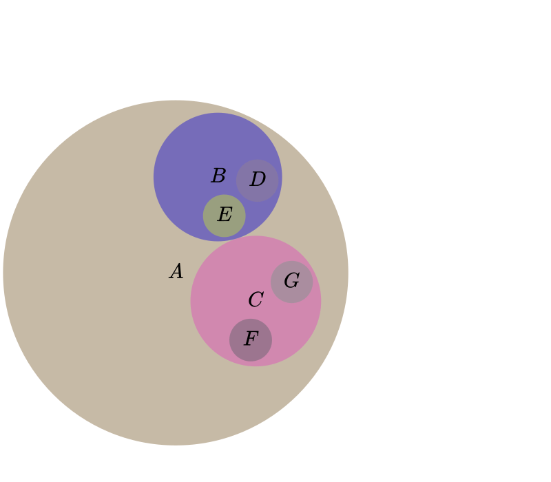

# Penrose [](https://github.com/penrose/penrose/actions/workflows/build.yml) [](https://codecov.io/gh/penrose/penrose) [](https://github.com/prettier/prettier) [](LICENSE) [](https://twitter.com/UsePenrose)

[Penrose](https://penrose.cs.cmu.edu/) is a platform that enables people to
**create beautiful diagrams just by typing mathematical notation in plain
text.** The goal is to make it easy for non-experts to create and explore
high-quality diagrams and provide deeper insight into challenging technical
concepts. We aim to democratize the process of creating visual intuition.

Check out our [SIGGRAPH '20 paper](https://penrose.cs.cmu.edu/siggraph20.html)
and [video](https://vimeo.com/416822487) on Penrose!

## Usage

You can [try Penrose in your browser](https://penrose.cs.cmu.edu/try/index.html)
without any installation. For a more detailed step-by-step introduction, check
out our [tutorials](https://penrose.cs.cmu.edu/docs/tutorial/welcome). Or, for
more reference-style information, take a look at our
[documentation](https://penrose.cs.cmu.edu/docs/ref).

## Example

Here's a simple Penrose visualization in the domain of set theory.



It's specified by the following trio of Domain, Substance, and Style programs
(with variation `PlumvilleCapybara104`):

- `setTheory.dsl`:

  ```
  type Set
  
  predicate Not(Prop p1)
  predicate Intersecting(Set s1, Set s2)
  predicate IsSubset(Set s1, Set s2)
  ```

- `tree.sub`:

  ```
  Set A, B, C, D, E, F, G
  
  IsSubset(B, A)
  IsSubset(C, A)
  IsSubset(D, B)
  IsSubset(E, B)
  IsSubset(F, C)
  IsSubset(G, C)
  
  Not(Intersecting(E, D))
  Not(Intersecting(F, G))
  Not(Intersecting(B, C))
  
  AutoLabel All
  ```

- `venn.sty`:

  ```
  canvas {
    width = 800
    height = 700
  }
  
  forall Set x {
    x.icon = Circle {
      strokeWidth : 0
    }
  
    x.text = Equation {
      string : x.label
      fontSize : "25px"
    }
  
    ensure contains(x.icon, x.text)
    encourage sameCenter(x.text, x.icon)
    x.textLayering = x.text above x.icon
  }
  
  forall Set x; Set y
  where IsSubset(x, y) {
    ensure smallerThan(x.icon, y.icon)
    ensure disjoint(y.text, x.icon, 10)
    ensure contains(y.icon, x.icon, 5)
    x.icon above y.icon
  }
  
  forall Set x; Set y
  where Not(Intersecting(x, y)) {
    ensure disjoint(x.icon, y.icon)
  }
  
  forall Set x; Set y
  where Intersecting(x, y) {
    ensure overlapping(x.icon, y.icon)
    ensure disjoint(y.text, x.icon)
    ensure disjoint(x.text, y.icon)
  }
  ```

## Contributing

See [`CONTRIBUTING.md`](CONTRIBUTING.md).

## License

This repository is licensed under the [MIT License](LICENSE).
