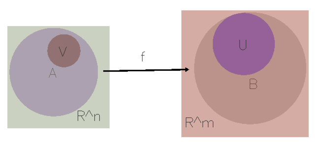

# Penrose

We're building a prototype for set theory. Not ready for contributions or public use yet, but hopefully will be after this summer! See [](penrose.ink) for more information.

----
### Example

Consider the following Substance and Style program,
- `continuousmap.sub`
    ```
    Set A
    Set B
    Set R^n
    Set R^m
    Subset A R^n
    Subset B R^m
    Map f A B
    Set U
    Subset U B
    Set V
    Subset V A
    ```
- `continuousmap.sty`
    ```
    Shape Set Circle
    Shape Map SolidArrow
    Shape R^n Box
    Shape R^m Box
    ```
Here is how Penrose visualizes this:



----

### Usage

Install any relevant packages: `cabal install $PACKAGE_NAME` (though I'm told the Haskell community has moved on to the better `stack` package manager).

To compile both:
`ghc Runtime.hs`

To just compile Compiler:
`ghc Compiler.hs`

To use:
`./Runtime <filename>.sub <filename>.sty`

User interface:
* You can click and drag the objects, including labels. The optimization will pause while dragging and re-layout when the mouse is lifted. The object on top is semi-arbitrary, decided by the order of the objects in the internal list.
* Pressing the `R` key will resample the configuration.
* Pressing the `A` key will turn autostep (automatically stepping the optimization) on or off.
* Pressing the `S` key will step the optimization by one step if autostep is off. It won't do anything if autostep is on.

Examples of existing pairs:
* twosets.sub settheory.sty
* continuousmap1.sub continuousmap1.sty (system doesn't currently handle this)

----

### Organization

`src` contains the compiler and runtime.

`src/GC-slides` contains slides from weekly group meetings.

`src/gifs` and `src/pictures` contain GIFs and pictures documenting new features in the system.

Other directories in the root contain documentation and old parts of the system.

----

### More information

I use the following library to handle the graphics, animation, and user input: [gloss](https://hackage.haskell.org/package/gloss-1.10.2.3/docs/Graphics-Gloss-Interface-Pure-Game.html).

Functionality of the current code:

* gradient-descent-based layout
* with backtracking line search
* for set theory with points, sets, and certain constraints on points and sets
* with very simple objective functions provided (e.g. centering)
* where the layout is animated and interactive (v. useful for debugging)

Some limitations:

* line search sometimes doesn't terminate
* need a better debugging interface for optimization, e.g. live parameter tuning

Parameters:

* stepsPerSecond: number of simulation steps for `gloss` to take for each second of real time
* picWidth, picHeight: canvas dimensions
* stepFlag: turns stepping the simulation on and off for debugging (no stepping = objects don't move)
* clampFlag: turns clamping gradient values on and off for debugging
* debug: turns on/off the debug print functions
* constraintFlag: turns constraint satisfaction on/off (currently off because we're doing unconstrained optimization)
* Default ambient objective functions are specified in `ambientObjFns`, and analogously for `ambientConstrFns`.
* Default objective functions are specified in `genObjsAndFns`.
* btls: turn on/off the backtracking line search for debugging (off = use a fixed timestep specified in the code)
* alpha and beta: parameters for the backtracking line search (see code for a more detailed description)
* stopEps: stopping condition sensitivity for gradient descent. Stop when magnitude of gradient is less than stopEps.

Debugging:

* Use the flags above.
* I also use `ghci`, the Haskell REPL. To load the file, do `:l filename.hs`. To import a library, paste in the normal import statement. To declare something, start with a `let` statement, e.g. `let x = 5`.
* For printing internal values, I use the [Debug.Trace](https://hackage.haskell.org/package/base-4.9.0.0/docs/Debug-Trace.html) library.

----

### Design

* Compiler parses the Substance and Style programs and combines their abstract syntax trees into Layout (the intermediate layout representation).
* Runtime calls Compiler on the input files, and transforms the data in Layout to Opt (the representations used by the optimization code).
* Runtime imports Compiler as a module.

----

### Usage for old code

Compile: `ghc settheory.hs`

Create SVG: `./settheory -w 500 -h 500 -o set.svg`
(The parameters are the width and height of the rendered picture.)

Open SVG: `chrome set.svg`
