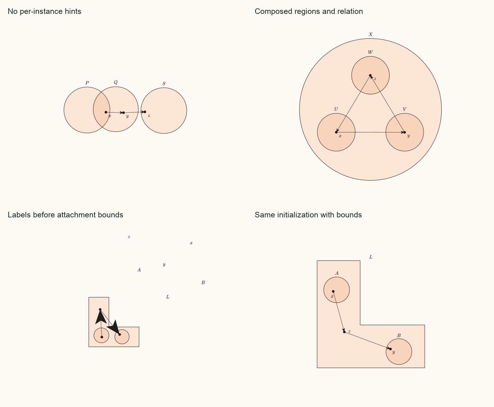

# Constraint use and reuse in the topology corpus

The current reconstruction uses Penrose's renderer and mathematical TypeScript
modules, but its registered figures do not use authored constraints to construct
their geometry. That is a substantial limitation of the implementation I made.
Faithful source drawings, reusable mathematical declarations, and a composable
constraint-based visual language are three different achievements. The corpus
establishes the first two to varying degrees; it does not establish the third.

This report audits all 110 registered programs, experiments with shared styles
that actually optimize geometry, records small library corrections, and proposes
research questions grounded in those experiments. It does **not** claim that all
110 book figures have been converted to the experimental styles.

## Scope and method

The corpus comprises 100 source reproductions and 10 added illustrations. The
source reproductions include 96 numbered figures, an unnumbered diagram, two
mathematical tables, and the cover. Source availability is still limited by the
missing pages recorded in [the source audit](source-audit.json).

The corpus source baseline is commit
`baf76d69f3b200a31b4d9a0dc82d93bbbd2d168f`. The [machine-readable audit](constraint-audit.json)
records the runtime build fingerprints and tracked framework edits present when
measurement started. Modules were loaded and cached before the 330 measurements;
this is a baseline corpus audit using that recorded runtime, rather than a claim
that every framework file came from a clean checkout of the baseline commit.

Each program was assembled in three modes: static, canonical interactive layout
with zero jitter, and resampled interactive layout with four units of jitter.
Instrumentation attributed constraints and objectives to authored styles,
generic canvas bounds, generic label interaction, or rigid-object interaction.
It traced variables reachable from selected geometric shape fields and energy expressions,
instead of counting every sampled default as meaningful freedom. Positive
controls checked that genuinely authored inputs, constraints, objectives, and
unresolvable constants were detected. All 330 runs finished within their bounds,
with no failed assemblies or nonfinite constraint values.

All 52 registered style files were reviewed. All 110 SVGs were also rendered
into six contact sheets and inspected for composition and representation
families. That visual review identifies needed invariants; it does not replace
the existing individual source-fidelity reviews or establish pixel-level
correctness of every small label or endpoint.

## What the existing figures actually optimize

| Mode                   | Programs | Authored constraints or objectives | Constraint terms | Objective terms | Geometric freedom                                               |
| ---------------------- | -------: | ---------------------------------: | ---------------: | --------------: | --------------------------------------------------------------- |
| Static                 |      110 |                                  0 |            2,674 |               0 | None                                                            |
| Interactive, canonical |      110 |                                  0 |            3,368 |           1,456 | 103 label-placement programs; 7 permit rigid-object translation |
| Interactive, resampled |      110 |                                  0 |            9,569 |           1,456 | The same restricted freedoms                                    |

The interactive variables reposition labels, sometimes with knockout companions,
or translate existing groups. They do not synthesize a different arrangement from
the mathematical relationships. The seven object-translation programs are the
cover, both tables, Figure 4.5, Figure 11.24, and the two group-kernel additions.

Static assembly registers 27,849 optimizer-eligible inputs across the corpus,
but **none is reachable from optimized geometric fields**. Shape defaults are often
sampled and then replaced by numeric props, leaving unused inputs registered.
The audit does not trace every paint/stroke field, so these are not proven dead
across every rendering field. Figure 5.7 alone has 4,614 inputs unreachable from
energy and the audited geometry. Counting these as free geometric variables
would materially overstate constraint use.

The source mechanisms differ: 24 style families are predominantly analytic or
data-driven, 10 predominantly use fixed source schematics, and 18 mix both. These
categories are not scores of mathematical correctness. For example, Figure 5.7
computes a genuine parametric torus mesh, whereas Figure 11.20 draws preset
ellipses and cubic generator curves after validating winding facts. Neither
registered style solves authored geometric constraints.

Several styles impose source-specific restrictions. The separated-disks style
accepts only the particular unit disks at `(0,0)` and `(2,0)`; the Baire styles
validate ball data but draw literal radii and select some witness roles by their
labels; Figure 11.24 requires a specific catalog of spaces and glyphs. Detailed
paths and line references are in the audit's `manualSourceReview` field. A separate
existing `eulerVennStyleFor` already constrains set relationships, but none of the
110 registered book programs uses it. The finding concerns this corpus, not an
absence of constraint support throughout Bloom.

At an audit threshold of `1e-5`, 25 static, 19 canonical interactive, and 23
resampled interactive programs retain positive residuals after `EPConverged`.
The largest registered residual is 19. Many are immutable canvas bounds or
conservative path bounds; a positive canvas residual does not by itself prove
visible clipping or mathematical error. It does prove that the solver's
termination flag is insufficient evidence of feasibility.

## Geometry that should remain mathematical

Maximizing constraint use should mean constraining the **right degrees of
freedom**, rather than freeing every coordinate. A metric-ball boundary, graph
of a function, winding number, or based-loop reparameterization encodes
mathematics. Replacing those coordinates with unrestricted layout variables
could destroy that meaning while producing a lower numerical energy.

The contact-sheet review suggests the following division:

| Examples                                                  | Preserve by construction                                             | Expose to layout constraints                                           |
| --------------------------------------------------------- | -------------------------------------------------------------------- | ---------------------------------------------------------------------- |
| 2.1–2.6, 2.12–2.13, 2.20; function and contraction plots  | Metric definitions, function values, monotonicity and limit behavior | Chart placement, scale policy, annotations and witnesses               |
| 4.1–4.2, 4.8–4.10, 7.4–7.6; product and quotient surfaces | Projection maps, surface parameterization and identifications        | Panel placement, camera choices, annotation clearance                  |
| 11.9–11.15, 11.19–11.21; retracing additions              | Basepoints, endpoints, parameterization and winding                  | Control handles under incidence/topology contracts, routing and labels |
| Neighborhood/set schematics, tables and graph glyphs      | Recorded facts, arithmetic, graph connectivity                       | Region parameters, witness locations, grid placement and edge routing  |

Recurring visual invariants include whole-region containment and common
intersection witnesses (2.18–2.19, 5.3, 7.3, 9.3, 9.12); boundary incidence and
open/closed endpoint semantics (2.9, 3.1, 3.5, 4.3, 5.9, 9.7); correct crossing,
hole and basepoint structure (9.2–9.3, 11.9, 11.21, 11.24); labels attached to the
correct feature (2.6, 2.18, 5.12, 7.3, 11.5, 11.12); and visibility or asymptotic
distinctions in surface and oscillating-curve drawings. These are requirements
the drawings rely on, not a claim that the existing SVGs violate all of them.

## Experiments with composable constraint styles

The experimental [region and relation styles](../../packages/bloom/src/styles/constraint-topology.tsx)
share the same optimized object views. The region style allocates free centers,
circle radii, and translated/resizable L-shaped polygons. It generates named
containment, membership, separation, and intersection constraints from the
existing set-theory vocabulary, plus point separation. The relation style attaches
arrows to those same points and adds clearance from nonincident nodes and labels.

The [Substance examples](../../packages/bloom/src/examples/constraint-topology.ts)
contain mathematical objects and facts. Book-like coordinates appear separately
as initial values and explicitly weak squared aesthetic preferences, never as
equalities requiring the final layout to match those coordinates. Initialization
and continued preference are distinct options; the experiment includes runs with
both position and size preferences disabled.

Two source-like tests use separated neighborhoods and nested sets. Four new
compositions use a neighborhood triangle with a relation, a many-to-one map,
membership in a concave L region, and an intersecting/disjoint set diagram with
relation arrows. The last composition uses only style defaults, with no
per-instance coordinate hints. A seventh example deliberately asks nonempty
regions to be both nested and disjoint.

The two styles must come from the same factory bundle and apply regions before
relations; this demonstrates shared-view reuse, not arbitrary compatibility of
independently authored modules. The separate generalization experiment below
tests that boundary explicitly.

The circle representation assumes nonempty sets. It constrains recorded positive
facts, not a complete set-theoretic model or inferred logical closure. The L
template keeps its notch proportions fixed; edges are not guaranteed to remain
inside a nonconvex region. These examples are controlled prototypes, not visual
replacements for the book's irregular contours or a complete topology DSL.
Independent SVG checks validate this geometric representation and its visual
margins; they do not prove arbitrary textbook propositions.

The [full experimental summary](constraint-experiments/topology-summary.md) links
all three 96-trial matrices: seven programs, three seeds, four perturbation sizes
(`0`, `5`, `90`, `160` pixels), and twelve additional trials without absolute
geometry/size priors in each revision. Every revision has 84 consistent cases and
12 deliberately contradictory ones.

| Label policy                             | Consistent cases finishing | Consistent cases feasible at `0.001` | Largest label/anchor distance among feasible cases |
| ---------------------------------------- | -------------------------: | -----------------------------------: | -------------------------------------------------: |
| Weak relative objectives, no bound       |                      84/84 |                                83/84 |                                     399.040 pixels |
| Required 24-pixel distance bound         |                      83/84 |                                77/84 |                                   24.000029 pixels |
| Same bound using scaled squared distance |                      83/84 |                                79/84 |                                   24.000033 pixels |

The squared residual is `(distanceSquared - boundSquared) / (2 * bound)`,
preserving approximately the same residual scale near the boundary while
avoiding the square root. Adding a useful visual invariant makes solving harder.
The final revision improves label attachment, but does not restore the original
success rate or eliminate divergence. Its failures include a 4.75-pixel
membership-clearance violation, three L-layout failures below 0.73 pixels, and
one divergent run with finite inputs and a constraint value around `2.1e37`.
The earlier distance-bound revision also has a nonfinite run. These are retained
in the data, rather than repaired with per-instance coordinate constraints.

All 36 final canonical/small-perturbation consistent cases are feasible. Final
weak-prior cases pass 69/72; cases without geometry priors pass 10/12. Every
contradictory case finishes while infeasible. Arrows share the exact optimized
node coordinates, but bipartite arrows still cross: there are 14 crossings across
the twelve final weak-prior map trials. Crossings are not forbidden by the
function facts, and this prototype does not claim planarity.



The lower panels use the same perturbed initialization; the final revision also
uses smaller arrowheads. Region dimensions and positions remain optimized, so
adding label constraints can change the surrounding geometry as well.

The separate [generalization experiment](constraint-experiments/generalization.json)
reuses one literal style bundle across nine assemblies: two, three or five
pairwise-disjoint regions, two member points per region, and chain relations,
each with original labels, renamed labels, or reversed declaration order. All
nine pass independent rendered membership/disjoint checks, in 25–187 native
step calls. No per-instance coordinates or geometry/size priors are supplied;
generic initialization and relative label objectives remain. This is evidence
of reuse across instance changes, not identical pixels or global search reliability.

Pairing a region style and relation style from different bundles produces the
expected explicit rejection. Their private shared-view map is still coupled.
Interchangeable independently authored visual modules remain a design problem.

## Initialization, stability and scale

The [solver experiments](constraint-experiments/solver.json) isolate two circles,
four center variables, fixed radii 35, and required clearance 10. They use the
native solver without changing its settings. Canvas constraints are deliberately
excluded to isolate one inequality, except for the representation-limited fixture;
these are diagnostic fixtures rather than complete diagram styles. An independent
oracle checks actual SVG circle geometry.

| Initial state and policy                                      | Native step calls | Result                                                |
| ------------------------------------------------------------- | ----------------: | ----------------------------------------------------- |
| Already feasible, no aesthetic preference                     |                 6 | Initial coordinates retained                          |
| Distinct overlapping centers, no preference                   |                 6 | Feasible, but centers escape to approximately ±15,010 |
| Exactly coincident centers, with or without a weak preference |                 6 | `EPConverged`, still violates clearance by 80         |
| Distinct overlapping centers, weak preference `0.002`         |                15 | Centers settle near ±40.000618                        |
| Coincident centers perturbed by `0.0001`, weak preference     |                20 | Feasible near ±40                                     |

At coincidence the chosen AD gradient of the distance penalty is zero. This is
a nondifferentiable, symmetric configuration, not evidence that the separation
inequality is mathematically incorrect. A tiny symmetry-breaking initialization
helps this fixture. It is not a general completeness guarantee for nonlinear
constraint solving.

The large escape without a preference is also feasible: the inequality leaves an
unbounded feasible region with no reason to choose the nearest solution. Warm
initialization alone does not express a stability policy. A weak preference
provides that policy without turning source coordinates into hard constraints.

For five scales (`1e-6`, `1e-4`, `0.01`, `1`, `100`), normalizing residuals while
keeping raw coordinate variables yields 36, 98, 19, 15 and 7 step calls with the
same weak preference. Normalizing **both variables and residuals** yields 15 calls
at every scale and practically identical reference-coordinate layouts. These
small examples establish sensitivity, not a performance model for all diagrams.

A further probe at scale `1e-9` needs 22 calls even with normalized variables,
rather than 15. The library counterexamples show why normalization alone is
insufficient: the global square-root derivative floor changes a tiny distance's
AD derivative from the mathematical value 1 to 0.001. Numerical regularization
must also respect geometric scale. Tiny SVG coordinate differences are additionally
subject to floating-point cancellation around the screen-coordinate origin.

The representation-limited fixture uses satisfiable abstract disjoint sets but
fixed radius-35 circles on a width-50 canvas. No such circle fits that canvas,
independently of the relationship between the sets. It terminates with violations,
as do the logically conflicting nested/disjoint fixture and the feasible-but-
coincident stagnation fixture. These causes require different explanations and
remedies.

An additional diagnostic problem is units: the tiny raw fixture's initial
residual is `0.00006`, so an absolute tolerance of `0.001` calls it feasible even
though it violates the required clearance by 60 reference units. The new
diagnostics report registered values and caller-selected tolerances; they do not
automatically normalize units or undo weights.

## Corrections made to Penrose

The [library counterexamples](constraint-experiments/library-counterexamples.json)
record the numerical evidence. Current regression tests independently check
geometric signs, finite-difference gradients, orientation, repeated vertices,
live deformation, and actual solver behavior.

| Defect                                                               | Observed effect                                                      | Correction                                                               |
| -------------------------------------------------------------------- | -------------------------------------------------------------------- | ------------------------------------------------------------------------ |
| Concave containment combines convex pieces with a maximum            | A valid point `(3,0.4)` in an L arm is pushed toward `(1,1)`         | Signed distance to the actual simple-polygon boundary, including padding |
| Polygon/circle separation uses bounding boxes                        | A disk in the empty notch at `(2,2)` is pushed to about `(2,-0.30)`  | Symmetric polygon/disk boundary-clearance query                          |
| Circle/rectangle containment uses a crude radius and ignores padding | A 6×8 rectangle in a radius-5 circle reports residual 3              | Actual rotated corners and requested clearance                           |
| Collapsed segment projection divides by zero                         | Repeated vertices or collapsed edges can produce nonfinite values    | Guard the denominator and reuse the finite segment-distance helper       |
| Polygon scale differs between renderer, bounding box and queries     | Visible and constrained geometry disagree; scale zero renders as one | Apply live scale in Penrose coordinates before screen conversion         |
| An explicit weight of zero is treated as omitted                     | A disabled constraint/objective keeps full strength                  | Distinguish zero from `undefined`                                        |
| Completion obscures residual failures                                | Contradictory constraints can finish without being feasible          | Named, read-only `Diagram.getConstraintDiagnostics()`                    |

The concave point before/after comparison uses a fixed penalty of 1000, explicitly
recorded in the data. The disk separation comparison uses native exterior-penalty
constraints. These are different experiments, both demonstrating incorrect
geometry queries in the previous formulas.

The corrected polygon scale preserves default scale-one SVG output. For nonunit
scale it changes coordinates about the Penrose origin; stroke width stays
constant. Polygon/polyline geometry queries and bounding boxes continue to
exclude stroke. This is an observable correction to prior nonunit-scale behavior,
not an invisible refactor. Simple polygons are supported; holes and
self-intersections are outside the new signed-distance contracts.

Verification includes the full core suite (613 tests, including 31 new geometry
regressions), the full Bloom suite (192 tests), the Elementary Topology example
tests and gallery smoke test (120 tests), plus core/Bloom/examples type checks.
The experimental styles have
independent numeric checks against native rendered SVGs. Timings are single
machine measurements, not portable benchmarks.

## Engineering work worth doing next

Expose the existing layout-stage mechanism through the TSX API. Native Style
already supports staged geometry/label optimization, as documented in
[Diagram Layout in Stages](https://penrose.cs.cmu.edu/blog/staged-layout).
Bloom currently constructs one stage in `Diagram.makeState`; its TSX path cannot
declare the same stage masks. Wiring through that capability is engineering work.
Deciding stages automatically under module composition is a harder question.

Add normalized residual metadata and source provenance. Names now make failures
inspectable, but each term should also identify its originating proposition,
style/module location, unit, priority, geometric support assumptions, and an
independent verification policy. Provide distinct statuses for solver failure,
termination with violations, and verified numerical feasibility.

Remove unused sampled defaults from optimization states, preserving deterministic
sampling semantics. The audit finds 27,849 eligible inputs unreachable from energy
and audited geometric fields in static assembly. Verify full-field liveness
before pruning. A liveness pass is a plausible improvement; this study has not
measured the resulting speedup.

Improve geometric contracts before adding more names to the library. A triangle
can have every vertex inside a concave L while an edge crosses the notch:
`containsPolys` reports `-0.5`, but a crossing midpoint is outside by `0.75`.
Its documentation now states the vertex-only guarantee. A cubic that fits a
10×6 canvas can nevertheless receive an `onCanvas` residual of 14 because bounds
use its control-point hull rather than its actual extrema. Exact curve bounds,
whole-edge containment, and visible-ink collision checks need targeted work.
Existing polygonal-chain curvature, convexity and turning-number functions are
useful building blocks; the limitation concerns guarantees for composed paths,
regions and representations, rather than an absence of all curve functionality.

## Research questions supported by this study

1. **What contract lets visual modules compose safely?** A region module and a
   relation module must share object identities and free variables without
   silently adding incompatible shape assumptions or duplicate views. Contracts
   should describe representation capabilities, boundary semantics, allowable
   degrees of freedom, and the meaning of each constraint. The L example shows
   why “supports containment” is too vague. A useful experiment would combine
   separately authored modules and check contracts before optimization, then
   measure which unexpected failures they prevent.

2. **How can a system explain underconstraint and conflict?** The escaping-circle
   fixture needs a stability policy; the coincident fixture needs a search
   direction; the inconsistent set fixture needs an explanation of conflicting
   requirements. They should not receive the same generic completion flag.
   Constraint provenance plus local Jacobian rank can provide evidence about
   missing freedoms and dependencies, while conflict explanations must distinguish mathematical
   inconsistency from representation limits and optimizer failure. Witness-based
   geometric constraint analysis already studies dependency and decomposition;
   applying it to inequalities, nonsmooth distances and composed diagram modules
   remains a concrete question. Rank depends on configuration and the active
   inequalities; it is not a global inconsistency certificate. See
   [Michelucci and Foufou's witness-configuration paper](https://doi.org/10.1016/j.cad.2006.01.005).

3. **How should priorities and stability work under composition and interaction?**
   Scalar weights mix required mathematics, legibility, source resemblance, and
   edit stability. Our weak preferences are useful, but remain manually chosen
   and scale-sensitive. Linear layout systems such as
   [Cassowary](https://badros.com/greg/papers/cassowary-tr.pdf) offer incremental
   solving and constraint hierarchies; they are prior art, not a drop-in solution
   for Penrose's nonlinear geometry. A promising evaluation compares a hybrid
   linear/nonlinear solver or explicit priority levels against scalar weights,
   measuring semantic violations, layout drift and response to dragging.

4. **How should continuous geometry interact with discrete topology?** Avoiding a
   graph crossing, selecting an edge route around a hole, preserving a loop's
   homotopy class, deciding visible branches, and choosing an intersection
   arrangement require discrete choices as well as numerical positions. The
   current L template fixes topology by construction and the graph styles do not
   guarantee crossing-free layouts. A research prototype could first choose a
   combinatorial arrangement or homotopy corridor, then optimize geometry within
   it, using independent intersection/winding checks to reject invalid results.
   The question is how to search, explain and update those choices as facts change.

5. **What makes solving reliable at project scale?** The units experiment shows
   that normalization needs to address variables as well as residuals. Many
   corpus drawings also use dense meshes or sampled curves whose visibility and
   collision graphs can change. Study dimensionless parameters, sparse dependency
   components, persistent warm starts, incremental updates, and multiresolution
   geometry. Compare feasible layouts and stability, not just energy or elapsed
   time. Penrose's
   [original system paper](https://penrose.cs.cmu.edu/siggraph20) supplies the
   optimization-based foundation; this study does not claim to invent constraint
   diagramming or to settle its global-search problems.

## A benchmark and migration plan

Keep exact source reproductions as a fidelity reference. Migrate one
representation family at a time to shared styles with named semantic and visual
constraints. Begin with set/neighborhood schematics and graph placement, where
the prototypes already demonstrate shared geometry. Preserve analytic formulas
for metrics and surfaces; free only documented presentation parameters.

For each family, test more than the original Substance: vary object counts,
rename labels, reorder declarations, combine modules, remove coordinate hints,
perturb initialization, change scale, add contradictory facts, and edit or drag
an object. Check both encoded residuals and independent mathematical/visual
invariants. Track source fidelity, label attachment, unintended crossings,
feasibility, sensitivity and timing separately. A style that only accepts the
original figure is a reconstruction recipe, not evidence of a reusable DSL.

This corpus can become a useful research benchmark precisely because it contains
multiple representation families. Its current fidelity is a starting reference;
successful novel compositions and transparent failures should become the evidence
for generality.

## Reproduce the measurements

From the repository root, build core and emit Bloom/examples, then run the audit
and the two experiment runners. The audit records runtime fingerprints; numbers
may change with later solver or label-measurement versions.

```sh
node_modules/.bin/tsc -p packages/core/tsconfig.json
node_modules/.bin/tsc -p packages/bloom/tsconfig.json
node_modules/.bin/tsc -p packages/examples/tsconfig.json
node scripts/elementary-topology/audit-constraints.mjs --out=tmp/elementary-topology/constraint-rerun.json
node scripts/elementary-topology/constraint-solver-experiments.mjs
node scripts/elementary-topology/constraint-library-experiments.mjs
node scripts/elementary-topology/experiment-constraint-topology.mjs tmp/elementary-topology/constraint-matrix all
node scripts/elementary-topology/constraint-generalization-experiments.mjs
```

The composable-style experiment runner and its matrices are linked above with the
final measurements. SVG geometry checks deliberately use independent numeric
distance/ray-casting code rather than calling the same constraint expressions
that the optimizer uses.
