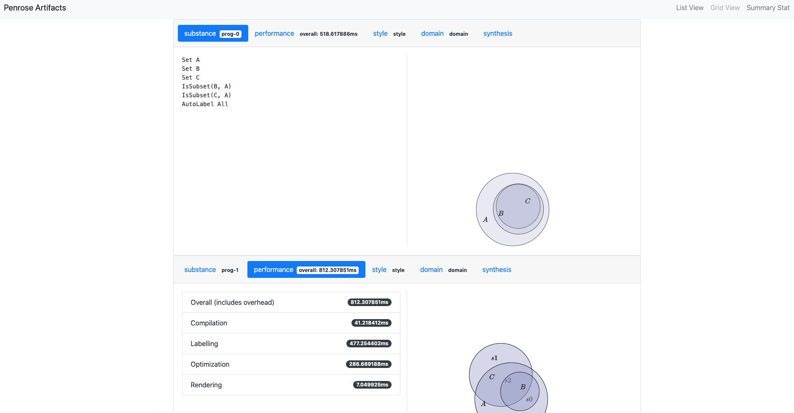

# `@penrose/automator`: a headless renderer for Penrose

This package is a command-line application that depends on `@penrose/core` and batch-processes multiple Penrose diagrams.

Usage:

```
Penrose Automator.

Usage:
  automator batch LIB OUTFOLDER [--folders] [--src-prefix=PREFIX] [--repeat=TIMES] [--render=OUTFOLDER] [--cross-energy]
  automator render ARTIFACTSFOLDER OUTFOLDER
  automator ascii ARTIFACTSFOLDER OUTFILE
  automator draw SUBSTANCE STYLE DOMAIN OUTFOLDER [--src-prefix=PREFIX] [--variation=VARIATION] [--folders] [--cross-energy]
  automator shapedefs [SHAPEFILE]

Options:
  -o, --outFile PATH Path to either a file or a folder, depending on the value of --folders. [default: output.svg]
  --folders Include metadata about each output diagram. If enabled, outFile has to be a path to a folder.
  --src-prefix PREFIX the prefix to SUBSTANCE, STYLE, and DOMAIN, or the library equivalent in batch mode. No trailing "/" required. [default: .]
  --repeat TIMES the number of instances
  --cross-energy Compute the cross-instance energy
  --variation The variation to use
```

## Getting started

- Follow the instruction in the [wiki page](https://github.com/penrose/penrose/wiki/Building-and-running) to install Penrose.
- Run `yarn start batch registry.json out/ --src-prefix=../examples/src/` in this directory. The output SVGs will appear in `out`.

## Using `automator` for local development

- If you are developing a module in `core` (e.g. `Synthesizer`), you can run `yarn start` in the project root direcory, which will continuously watch your changes in `core` and update your build.
- Check the console before you run `automator` to make sure your changes in `core` are not causing any errors.
- If the build is successful, `automator` will now be using the most recent version of `core` when batch-processing Penrose programs.

## Static site generation

In addition to batch-processing Penrose programs, you can also use `automator` to generate a static site for viewing the diagrams and metadata (e.g. performance statistics). Here's an example:

- Run `yarn start batch registry.json out --src-prefix=../examples/src/ --folders` in this directory.
  - Different from the example above, the `--folders` option asks `automator` to output metadata along with SVGs. `automator render` requires the output to have associated metadata.
- Run `yarn start render out browser` to generate a static site.
- Open `browser/index.html` to view the result.


