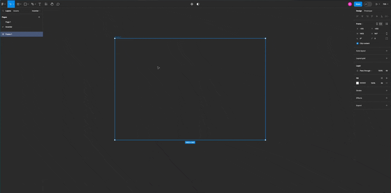

<script setup>
import StagedDiagram from "../src/components/StagedDiagram.vue";
import { ref } from 'vue'
import vector from "@penrose/examples/dist/exterior-algebra/vector-wedge.trio";
import laplace from "@penrose/examples/dist/walk-on-spheres/laplace-estimator.trio.js";
import geometry from "@penrose/examples/dist/geometry-domain/textbook_problems/c05p13.trio.js";
import nitric from "@penrose/examples/dist/molecules/nitricacid-lewis.trio.js"
import graphTrio from "@penrose/examples/dist/graph-domain/textbook/sec1/fig4.trio.js"
import curved from "@penrose/examples/dist/graph-domain/textbook/sec5/ex32.trio.js"
import space from "@penrose/examples/dist/timeline/penrose.trio.js"
import blobTrio from "@penrose/examples/dist/curve-examples/blobs.trio.js"
import euclideanOneStage from "./euclideanOneStage"
import { defineComponent } from "vue";

const exterior = {
  trio: {
    substance: vector.substance,
    style: vector.style[0].contents,
    domain: vector.domain,
    variation:"ArtemisCrane740"
  },
  imageResolver: vector.style[0].resolver,
}
const wos = {
  trio: {
    substance: laplace.substance,
    style: laplace.style[0].contents,
    domain: laplace.domain,
    variation: "test3",
  },
  imageResolver: laplace.style[0].resolver,
}
const incenterOneStage = {
  trio: {
    substance: geometry.substance,
    style: euclideanOneStage,
    domain: geometry.domain,
    variation: "test8",
  },
  imageResolver: geometry.style[0].resolver,
}
const incenter = {
  trio: {
    substance: geometry.substance,
    style: geometry.style[0].contents,
    domain: geometry.domain,
    variation: "WindsweptPheasant618",
  },
  imageResolver: geometry.style[0].resolver,
}
const nitricAcid = {
  trio: {
    substance: nitric.substance,
    style: nitric.style[0].contents,
    domain: nitric.domain,
    variation: "test",
  },
  imageResolver: nitric.style[0].resolver,
}
const curvedGraph = {
  trio: {
    substance: curved.substance,
    style: curved.style[0].contents,
    domain: curved.domain,
    variation: "BasilTapir4665",
  },
  imageResolver: curved.style[0].resolver,
}
const graph = {
  trio: {
    substance: graphTrio.substance,
    style: graphTrio.style[0].contents,
    domain: graphTrio.domain,
    variation: "BasilTapir4665",
  },
  imageResolver: graphTrio.style[0].resolver,
}
const spaceCurve = {
  trio: {
    substance: space.substance,
    style: space.style[0].contents,
    domain: space.domain,
    variation: "BasilTapir4665",
  },
  imageResolver: space.style[0].resolver,
}
const blob = {
  trio: {
    substance: blobTrio.substance,
    style: blobTrio.style[0].contents,
    domain: blobTrio.domain,
    variation: "BasilTapir4665",
  },
  imageResolver: blobTrio.style[0].resolver,
}
</script>

<BlogMeta />

Layout optimization can get pretty complicated even for simple diagrams. We introduced layout stages to make it simpler!

---

## Layout optimization becomes complicated quickly

In Style, we can write `ensure` and `encourage` statements to declare constraints and objectives. The compiler turns them into a numerical optimization problem, and the optimizer finds a good layout. This simple approach worked fairly well in the early years of Penrose. However, as we authored more complex diagrams in Penrose, the optimizer started to struggle.
For example, we have built a series of diagrams in 2D Euclidean geometry where the optimizer was unable to consistently produce good layouts, like this one:

<!-- <div style="width: 55%; float:right; margin-left: 16px; margin-top: 16px"> -->
<div style="display: flex; justify-content: center">
  <div style="width: 100%; max-width: 320px">
    <StagedDiagram :trio="incenterOneStage.trio" :imageResolver="incenterOneStage.imageResolver" />
  </div>
</div>

Conceptually, this diagram illustrates the _incenter_ $P$ of $\triangle JKL$, where $P$ is equidistant from the triangle's sides. The layout problem can be broken down into:

- Lay out points $J$, $K$, and $L$ to form a [non-degenerate triangle](<https://en.wikipedia.org/wiki/Degeneracy_(mathematics)#Triangle>).
- Compute the location of the incenter $P$ of $\triangle JKL$.
- Lay out point $m$ on $\overline{KL}$.
- Lay out $\overline{mP}$ perpendicular to $\overline{KL}$.
- Lay out all point labels so they are close to the points.
- If the label is for a triangle vertex, make sure it's outside of the triangle.

Aside from the location of $P$, everything else is optimized. And as you can see, the optimizer attempts to achieve **all of the above concurrently**. For example, notice that Penrose tries to keep the labels close to the points in every frame of the layout animation.

In [a GitHub issue about this problem](https://github.com/penrose/penrose/issues/766), [Keenan](https://www.cs.cmu.edu/~kmcrane/) summarized the general problem well:

> [A]t some point it becomes hard to strike a balance between many competing constraints and objectives. Anyone who has ever worked with continuous optimization knows the challenge: you want to simultaneously optimize $f(x)$ and $g(x)$, but if $f$ and $g$ differ on what they consider "good" states $x$, then they will effectively compete—usually reaching a solution that nobody likes.
> ...designing constraints and objectives becomes (very) hard when you're laying out the diagram all at once, because everything affects everything.

Clearly, we need a better solution.

## Layout is often done in multiple stages by hand

When using WYSIWYG tools to draw diagrams, we often use groups and layers to lay out parts of a diagram before others. For example, I drew a similar diagrams to the one above in Figma:



Notice that I didn't place labels until the very end. This is a common strategy. Just like the Penrose optimizer, it's hard for me to consider the location of both labels and shapes at the same time!

## Staging makes layout a lot easier in Penrose

Separating shape layout and label layout helped me reduce my [cognitive load] (https://en.wikipedia.org/wiki/Cognitive_load). We decided to **divide the layout optimization problem into multiple stages** to help the optimizer. Here's the same example as above, but laid out in two stages:

- `shape`: lay out the vertices for $\triangle JKL$, the incenter $P$, and point $m$.
- `label`: put all labels near the points they label.

<div style="display: flex; justify-content: center">
  <div style="width: 100%; max-width: 320px">
    <StagedDiagram :trio="incenter.trio" :imageResolver="incenter.imageResolver" />
  </div>
</div>

As expected, the layout optimizer lays out the triangle first, and then moves labels around without moving the triangle itself. This leads to massively more reliable layouts for this example and a shorter layout solve time on average. I initially experimented with these two layout stages by hardcoding layout stages in the optimizer in [an experimental PR](https://github.com/penrose/penrose/pull/1115/files).

## Now you can specify layout stages in Style!

How does Penrose determine the layout stages? The right layout strategy may be different for each diagram type. Penrose users already use the Style language to define the layout problem, shapes, and styling for each diagram type. Why not let users specify stages in Style, too? In a [subsequent PR](https://github.com/penrose/penrose/pull/1199), I introduced a more general language feature for layout stages. Here's how it works:

In Style, we provide language constructs for annotating variables (`?`), constraints (`ensure`), and objectives (`encourage`) with layout stages. At layout time, the optimizer executes layout stages in order. For instance, the user may want to layout shapes before laying out labels. Using the feature, they can separate varying values and constraints into distinct sets to be optimized in stages.

The layout stages are optionally defined at the top level as a list of names in Style:

```style
layout = [shape, label, overall]
```

If undefined, `layout` gets a default anonymous stage, i.e. the default mode where all inputs and constraints are jointly optimized at once.

In Style blocks, inputs and constraints can be associated with stages via the `in` and `except` keywords.

```style
-- `a` can be altered by the layout engine in the `shape` stage
a = ? in shape
-- `b` can be altered in both `shape` and `overall` stages
b = ? in [shape, overall]
-- this is equivalent to above
c = ? except label
-- if not specified, a variable participates in all stages
d = ? in [shape, label, overall]
e = ?
-- the same thing can be done to constraints and objectives
ensure a == 20 in shape
encourage c > 20 except label
```

Here's what I did to change how the shape and label of a `Point` is laid out in the Euclidean 2D Style.

```style {1,8-9,13-15,27-29}
layout = [shape, label]

forall Point p {
  p.text = Equation {
    string : p.label
    fillColor : Colors.black
    fontSize : const.fontSize
    -- `in` after any `?` includes the variable in one or more stages
    center: (? in label, ? in label)
    ensureOnCanvas: false
  }

  -- `except` includes the variable in all but the specified stages
  p.x = ? except label
  p.y = ? except label
  p.vec = (p.x, p.y)
  p.color = Colors.black

  p.icon = Circle {
    center: p.vec
    r : const.pointRadius
    fillColor : Colors.black
    strokeWidth : 0.0
    strokeColor : Colors.black
  }

  ensure onCanvas(p.text, canvas.width, canvas.height) in label
  ensure signedDistance(p.text, p.vec) == const.textPadding + const.pointRadius in label
}
```

This is a surprisingly simple language feature to implement. It required some refactoring of the optimizer to "freeze" and "unfreeze" variables in an optimization problem (thanks to [Sam's PR on variable masking](https://github.com/penrose/penrose/pull/1192)) and less than a day of work for me to implement. But it unleashes the power of **customizing the layout solving strategy** to every Style writer. Beyond a simple shape-label pipeline, for example, [Jiri](https://github.com/jiriminarcik) built graphs with curved edges using an 8-stage layout with repeated stages. As a language designer, it's truly incredible to see what people can do with seemingly simple language features:

<div style="display: flex; justify-content: center">
  <div style="width: 100%; max-width: 320px">
    <StagedDiagram :trio="curvedGraph.trio" :imageResolver="curvedGraph.imageResolver" />
  </div>
</div>

## Others have built cool examples using layout stages

We've made a lot of examples using this feature already! Here are a few:

<div style="display: grid;   grid-template-columns: repeat(auto-fit, minmax(320px, 1fr)); grid-gap: 20px">
<StagedDiagram :trio="wos.trio" :imageResolver="wos.imageResolver" />
<StagedDiagram :trio="nitricAcid.trio" :imageResolver="nitricAcid.imageResolver" />
<StagedDiagram :trio="graph.trio" :imageResolver="graph.imageResolver" />
<StagedDiagram :trio="blob.trio" :imageResolver="blob.imageResolver" />
<div style="grid-column: 1 / -1">
  <StagedDiagram :trio="spaceCurve.trio" :imageResolver="spaceCurve.imageResolver" />
</div>
</div>

## Caveats and future work

Exposing staging at the language level also introduces some potential pitfalls. One may write a staging Style that's impossible to optimize for. For example, here I try to put a `Text` in a `Circle` but mistakenly included the `center` of the `Text` in the wrong stage.

```style
canvas {
    width = 500
    height = 500
}
layout = [circle, text]
global {
    icon = Circle {
      center: (? in circle, ? in circle)
      r: ? in circle
    }
    text = Text {
      center: (? in circle, ? in circle) -- `text` won't move for `contains`! // [!code error]
    }
    ensure icon.r == 50 in circle
    ensure norm(icon.center - (0, 0)) == 0 in circle
    ensure contains(icon, text) in text
}
```

The issue is not unique to this feature. In Style, it's possible to specify unsolvable layout problems without staging! Detecting infeasible layout specification in general is an interesting (and very hard) problem we'd like to explore in the future. Similarly, automatically detecting layout stages from any Style program is also a great research problem.

While we are pushing the frontier of automatic diagram layout further in the research world, we also care about delivering pragmatic solutions to the world. We could have easily spent a month trying to automatically stage our optimizer, but spending a few days to ship the Style language feature enabled so many great examples. Balancing research problem-solving and practical toolsmithing is hard, but perhaps that's why I like doing this so much 💙.
