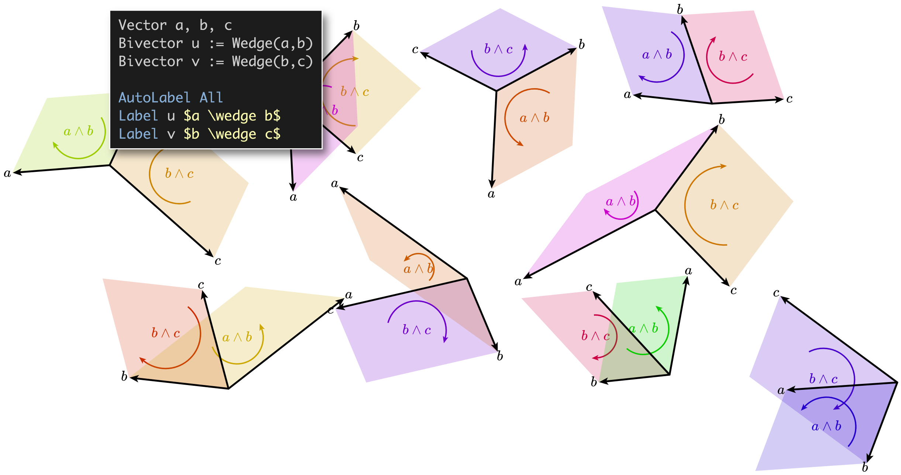

# Description

This domain is a basic stub for depicting operations on k-vectors from [exterior algebra](https://en.wikipedia.org/wiki/Exterior_algebra) (also known as Grassmann algebra, which is a building block for [Clifford algebra](https://en.wikipedia.org/wiki/Clifford_algebra), [geometric algebra](https://en.wikipedia.org/wiki/Geometric_algebra), and [exterior calculus](https://en.wikipedia.org/wiki/Exterior_calculus)). It currently implements only one operation (the wedge product on a pair of vectors, visualized via an oriented parallelogram), but could easily be extended to other operations and visualizations.

The main Domain schema and Style program are in `exterior-algebra.[dsl|sty]`, and a (very) simple example Substance program can be found in `vector-wedge.sub`.

**Example:**

