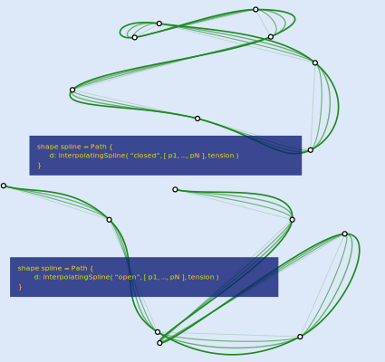

# catmull-rom

Tests Catmull-Rom interpolation via the `interpolatingSpline` function in Style, and shows an example of how to use collection to interpolate through a collection of points defined via Substance.
