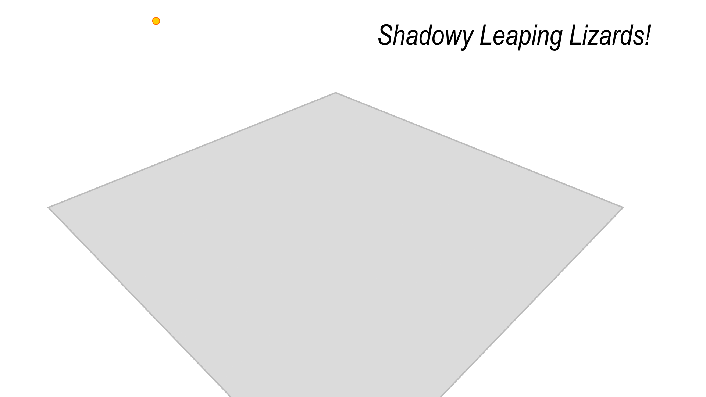

# dinoshade


This exploratory example shows how rich 3D graphics including lighting, shadows, reflections, and perspective projection can be rendered as 2D vector art via Penrose, using familiar concepts from standard 3D graphics APIs (such as OpenGL and Direct3D).  Penrose was not originally designed for 3D, and still lacks some major features common in the 3D world—but as the system evolves it becomes easier and easier to pull off some very cool and useful techniques!  This particular example reimagines the [`dinoshade` OpenGL/GLUT C++ example](http://sgifiles.irixnet.org/sgi/opengl/contrib/mjk/tips/dinoshade.c), originally written by Mark Kilgard at SGI.  This README is written mainly for folks to cross the bridge from 3D graphics APIs into Penrose/Style—if you've never written 3D graphics code before, you may want to start with one of the [many terrific tutorials](https://www.reddit.com/r/opengl/comments/5dbzp0/how_to_best_learn_opengl_in_20162017/) available online.

## Overview - The Vectorization Pipeline


The output for this example is shown at top: a dinosaur standing on a plane, with soft shadows and a blurry reflection; lighting and shadows are determined by a point light source (which from this view is off screen).  Construction of this example follows a pattern similar to the [real time graphics pipeline](https://en.wikipedia.org/wiki/Graphics_pipeline): the camera is defined via modelview and projection matrices, a list of 3D points is used to describe the scene geometry, and the camera matrices are used to transform these 3D points into 2D coordinates on the canvas.  The key difference, as illustrated in the diagram above, is that in the final stage projected primitives (such as triangles and line segments) are translated into vector graphics primitives, rather than rasterized to final pixel values.  In particular, they are translated into a [standard vector graphics (SVG) file](https://en.wikipedia.org/wiki/SVG), which is a human-readable file format for describing 2D graphics.  An SVG file can then be displayed by a variety of applications such as web browsers (Chrome, Safari, etc.), or specialized vector graphics editors (Inkscape, Adobe Illustrator, etc.).  These programs in effect complete the final stage of image generation, by rasterizing 2D shapes in the SVG file to pixel values that can be displayed by a hardware device.  However, deferring this final rasterization stage has a variety of benefits:

- **Retargetability.**  Since the output of the 3D vectorization pipeline does not assume any definite size for the final rasterized image, graphics can be re-used on a variety of different devices, or in different contexts (e.g., full-screen vs. embedded in a document) without losing fidelity.  In other words, the output representation is "resolution-independent."
- **File Size.** In many cases, a vectorized image is much smaller than a rasterized version, since the former stores a more minimal specification of the image (e.g., just the three corner locations of a triangles, rather than the many thousands of pixel values needed to fill in the same triangle).  E.g., the SVG and PNG versions of the `dinoshade` image above differ in file size by about 5x.
- **Editability.** Unlike raster images, which can be edited only at the level of individual pixels, vectorized 3D graphics easily admit higher-level semantic edits such as "change the color of the dinosaur from green to blue" or "make the wireframe thinner" (or remove it altogether).  Moreover, such alterations can be made programmatically and automatically without needing access to the original runtime environment (e.g., OpenGL or Direct3D).
- **Rich Functionality.** A lot of functionality that's hard to pull off in standard 3D APIs (like high-quality line drawing, dashed lines, and image-space filtering) are already built in to SVG/CSS, and can often be triggered by one or two simple commands (like the CSS blur used here to achieve glossy reflections).

## The Dinoshade Example

Let's walk through the `dinoshade` example step by step, which is largely contained in the Style program `dinoshade.style`.  Since Style is a [specification language](https://en.wikipedia.org/wiki/Specification_language) rather than a [programming language](https://en.wikipedia.org/wiki/Programming_language), many pieces of this example are much shorter than in the [original C++ example](http://sgifiles.irixnet.org/sgi/opengl/contrib/mjk/tips/dinoshade.c).  In other words, we can focus more on _"what gets drawn"_ rather than _"how to draw it"_.

### Scene Setup

We first need to define some global values that describe our scene, such as the image size, and the configuration of the camera and the lights.  The very first statement in any Style program (which is required) is the output size of the generated image:

```haskell
canvas {
   width = 1920
   height = 1080
}
```

Next, we define a single global camera used by all objects in the scene.  The camera determines how points get projected from 3D to 2D.  In Penrose, a camera is specified using the exact same commands as in OpenGL---here we use the equivalents of [`gluLookAt()`](https://registry.khronos.org/OpenGL-Refpages/gl2.1/xhtml/gluLookAt.xml), [`gluPerspective()`](https://registry.khronos.org/OpenGL-Refpages/gl2.1/xhtml/gluPerspective.xml), and [`glViewport()`](https://registry.khronos.org/OpenGL-Refpages/gl4/html/glViewport.xhtml):

```haskell
camera {
  -- Camera viewpoint
  -- (same parameters as the gluLookAt() command from OpenGL)
  vec3 eye = (30,30,30) -- where is the camera sitting?
  vec3 center = (0,0,0) -- what is the camera looking at?
  vec3 up = (0,-1,0) -- which direction is "up"?
  mat4x4 model = lookAt( eye, center, up )

  -- Camera projection
  -- (same parameters as the gluPerspective() command from OpenGL)
  scalar fovy = 40 -- field of view in degrees
  scalar aspect = canvas.width / canvas.height -- aspect ratio
  scalar near = 1.0 -- Z near
  scalar far = 40.0 -- Z far
  mat4x4 proj = perspective( fovy, aspect, near, far )

  -- Viewport
  -- (same parameters as the glViewport() command from OpenGL)
  list view = [ -canvas.width/2, -canvas.height/2, canvas.width, canvas.height ]
}
```

For more elaborate diagrams, one could of course define multiple cameras (e.g., declared as Substance variables, each with their own local parameters).

We also have a single global light used by all objects in the scene.  The light influences how polygons are shaded, and determines how our geometry gets projected onto the ground plane to draw a shadow:

```haskell
light {
  -- Light position
  scalar pointLight = 1 -- set to 0 for a directional light "at infinity"
  vec4 pos = ( -10, 30, 10, 1 )

  -- Draw a circle at the light location
  -- (Note that this widget won't be visible from all camera views)
  vec2 q = project( (pos[0],pos[1],pos[2]), camera.model, camera.proj, camera.view )
  shape lightBall = Circle {
     center: q
     r: 10
     fillColor: #ffcc00
     strokeColor: #ff6600
     strokeWidth: 2
  }
}
```

The `shape` statement is central to the way we specify a drawing in Style: rather than call a subroutine that executes drawing commands, we just specify the shape we want to draw (in this case for the light). Each line within the shape specifies an _attribute_, whose _value_ can be a fixed constant, a computed value that depends on other values, or even an unknown/undetermined value (indicated by a `?`) that will be automatically determined by the layout engine, via optimization. Here for instance we set the light center to a 2D location computed via 3D perspective projection, but use a fixed radius so that our light is always represented by a circle of fixed size in screen space (it is a point light after all!). These shapes will all in the end be "rendered," or really, written to an SVG file, in essentially the order they were declared (barring any explicit `layer` statements, which prescribe relative orderings). See the [Penrose documentation](https://penrose.cs.cmu.edu/docs/tutorial/welcome) for a more thorough introduction to how Style and Penrose work.

> **Homogeneous Coordinates.** You'll notice here that the light has _four_ coordinates rather than three, following the standard practice in computer graphics and computer vision of using [homogeneous coordinates](https://en.wikipedia.org/wiki/Homogeneous_coordinates#Use_in_computer_graphics_and_computer_vision).  Here for instance, the final coordinate provides the ability to render with a point light (final coordinate 1) or a directional light source "at infinity" (final coordinate 0).  This value is not merely a binary "flag" used to toggle between these options—rather, it directly and naturally factors into the shadow calculations themselves.  More generally, many of the 3D transformation functions in Penrose offer both homogeneous and non-homogeneous versions, as well as helper functions to convert to/from homogeneous coordinates (`toHomogeneous()` and `fromHomogeneous()`), to make standard calculations straightforward to implement.

Finally, we have some global data that we need only define once, such as the title of the diagram, the geometry and shape/shading of the ground plane, and the vertex coordinates of the dinosaur model:

```haskell
global {

   shape title = Text {
      center: (canvas.width/2 - 460,canvas.height/2 - 80)
      string: "Shadowy Leaping Lizards!"
      fontSize: "60pt"
      fontFamily: "Arial Narrow,Arial,sans-serif;"
      fontStyle: "italic"
   }

   -- draw one floor for the whole scene
   color floorColor = rgba( 0.3, 0.3, 0.3, 0.2 )
   list floorPoints = [ ( -20.0, 0.0, 20.0 ), ( 20.0, 0.0, 20.0 ), ( 20.0, 0.0, -20.0 ), ( -20.0, 0.0, -20.0 ) ]
   list p = projectList( floorPoints, camera.model, camera.proj, camera.view )
   shape floor = Polygon {
      points: [ (p[0][0],p[0][1]), (p[1][0],p[1][1]), (p[2][0],p[2][1]), (p[3][0],p[3][1]) ]
      fillColor: global.floorColor
      strokeColor: #bbb
      strokeWidth: 4.0
      ensureOnCanvas: false
   }
}
```

At this point our scene looks like this:



Notice that unlike a traditional 3D graphics API, we only had to declare _what needs to be drawn_; we did not have to spell out the procedural steps of _how to draw it_.  For instance, to draw the text we simply stated what string we want to use, what font/color we want, and where on the canvas it should go.  We didn't need to say _when_ the text gets drawn (i.e., we don't need to think about execution order, as in the usual [imperative programming](https://en.wikipedia.org/wiki/Imperative_programming) model of OpenGL/Direct3D), and avoided the arcane sequence of function calls needed to [draw text](https://users.cs.jmu.edu/bernstdh/web/common/lectures/summary_opengl-text.php) in OpenGL.  Intsead, we just gave the bare minimum information needed to specify the label.

The most important line in the snippet above is the one that transforms a list of 3D points into a list of 2D points that can be used to draw 2D shapes.  In general, the pattern we'll use is

```haskell
-- define a list of coordinates in 3D
list points3D = [ (x0,y0,z0), (x1,y1,z1), ..., (xN,yN,zN) ]

-- use the camera data to project 3D points to 2D
list points2D = projectList( points3D, camera.model, camera.proj, camera.view )
```

The function `projectList()` takes each of the points in the input list, applies the given modelview and projection transformations, and maps the final coordinates to the given viewport.  In fact, this function is equivalent to applying `gluProject()` to each point in the list.  A projection for a single point can also be computed, using just `project()` (or `projectDepth()`, which also provides the z-depth relative to the viewer).

Note that this transformation is directly analogous to applying a standard [vertex shader](https://www.khronos.org/opengl/wiki/Vertex_Shader#:~:text=The%20Vertex%20Shader%20is%20the,object%20by%20a%20drawing%20command.), and indeed one could expand on it to do any other kind of vertex processing.

### Drawing the Dinosaur

Next we get to the main event: drawing our dinosaur!  In brief: we first set some constants, like the color of the dinosaur and some lighting parameters.  We then grab the light vector `L` and normal vectors `N` that will be used to compute simple [Lambertian shading](https://en.wikipedia.org/wiki/Lambertian_reflectance#Use_in_computer_graphics).  To let the dinosaur "leap" around the scene, we construct a transformation matrix `D.model` based on a random location and orientation (chosen above).  Finally, we transform our vertex coordinates according to the local model transformation `D.model`, and the usual camera data, to get the 2D projection of the points in window coordinates:

```haskell
-- Rule for drawing the main dinosaur geometry
forall Dinosaur G {
   -- geometry used to define the dinosaur mesh
   list dinoPoints = [ (-8, 3, -1.5), (-7, 1, -1.5), (-7, 1, 1.5), (-8, 3, 1.5), (-3, 1, -1.5), (-3, 1, 1.5), (0, 4, -1.5), (0, 4, 1.5), (2, 4, -1.5), (2, 4, 1.5), (3, 5, -1.5), (3, 5, 1.5), (3, 11.5, -1.5), (3, 11.5, 1.5), (5, 12, -1.5), (5, 12, 1.5), (5, 13, -1.5), (5, 13, 1.5), (2, 13.5, -1.5), (2, 13.5, 1.5), (5, 14, -1.5), (5, 14, 1.5), (5, 15, -1.5), (5, 15, 1.5), (3, 16, -1.5), (3, 16, 1.5), (0, 16, -1.5), (0, 16, 1.5), (-1, 15, -1.5), (-1, 15, 1.5), (-1, 13, -1.5), (-1, 13, 1.5), (0, 12, -1.5), (0, 12, 1.5), (-1, 11, -1.5), (-1, 11, 1.5), (-2, 6, -1.5), (-2, 6, 1.5), (-4, 3, -1.5), (-4, 3, 1.5), (-5, 2, -1.5), (-5, 2, 1.5), (-7, 2, -1.5), (-7, 2, 1.5), (0, 10, 1.5), (1, 9, 1.5), (1, 9, 2.25), (0, 10, 2.25), (2, 9, 1.5), (2, 9, 2.25), (5, 8, 1.5), (5, 8, 2.25), (6, 9, 1.5), (6, 9, 2.25), (8, 9, 1.5), (8, 9, 2.25), (7, 9.5, 1.5), (7, 9.5, 2.25), (8, 10, 1.5), (8, 10, 2.25), (7, 10, 1.5), (7, 10, 2.25), (7.5, 11, 1.5), (7.5, 11, 2.25), (6.5, 10, 1.5), (6.5, 10, 2.25), (6, 11, 1.5), (6, 11, 2.25), (6, 10, 1.5), (6, 10, 2.25), (5, 9, 1.5), (5, 9, 2.25), (3, 11, 1.5), (3, 11, 2.25), (1, 11, 1.5), (1, 11, 2.25), (0, 6, 1.5), (0, 4, 3), (0, 6, 3), (1, 3, 1.5), (1, 3, 3), (1, 2, 1.5), (1, 2, 3), (0, 1, 1.5), (0, 1, 3), (0, 0.5, 1.5), (0, 0.5, 3), (1, 0, 1.5), (1, 0, 3), (4, 0, 1.5), (4, 0, 3), (2, 1, 1.5), (2, 1, 3), (2, 2, 1.5), (2, 2, 3), (4, 4, 1.5), (4, 4, 3), (3, 6, 1.5), (3, 6, 3), (2, 7, 1.5), (2, 7, 3), (1, 7, 1.5), (1, 7, 3), (0, 10, -2.25), (1, 9, -2.25), (1, 9, -1.5), (0, 10, -1.5), (2, 9, -2.25), (2, 9, -1.5), (5, 8, -2.25), (5, 8, -1.5), (6, 9, -2.25), (6, 9, -1.5), (8, 9, -2.25), (8, 9, -1.5), (7, 9.5, -2.25), (7, 9.5, -1.5), (8, 10, -2.25), (8, 10, -1.5), (7, 10, -2.25), (7, 10, -1.5), (7.5, 11, -2.25), (7.5, 11, -1.5), (6.5, 10, -2.25), (6.5, 10, -1.5), (6, 11, -2.25), (6, 11, -1.5), (6, 10, -2.25), (6, 10, -1.5), (5, 9, -2.25), (5, 9, -1.5), (3, 11, -2.25), (3, 11, -1.5), (1, 11, -2.25), (1, 11, -1.5), (0, 6, -3), (0, 4, -3), (0, 6, -1.5), (1, 3, -3), (1, 3, -1.5), (1, 2, -3), (1, 2, -1.5), (0, 1, -3), (0, 1, -1.5), (0, 0.5, -3), (0, 0.5, -1.5), (1, 0, -3), (1, 0, -1.5), (4, 0, -3), (4, 0, -1.5), (2, 1, -3), (2, 1, -1.5), (2, 2, -3), (2, 2, -1.5), (4, 4, -3), (4, 4, -1.5), (3, 6, -3), (3, 6, -1.5), (2, 7, -3), (2, 7, -1.5), (1, 7, -3), (1, 7, -1.5), (0.75, 15, -1.6), (1, 14.7, -1.6), (1, 14.7, 1.6), (0.75, 15, 1.6), (1.6, 14.7, -1.6), (1.6, 14.7, 1.6), (2.0999999, 15, -1.6), (2.0999999, 15, 1.6), (1.6, 15.25, -1.6), (1.6, 15.25, 1.6), (1, 15.25, -1.6), (1, 15.25, 1.6) ]
   list dinoNormals = [ (-0.894427, -0.447214, 0.), (0., -1., 0.), (0.707107, -0.707107, 0.), (0., -1., 0.), (0.707107, -0.707107, 0.), (1., 0., 0.), (0.242536, -0.970143, 0.), (1., 0., 0.), (0.164399, 0.986394, 0.), (0.164399, -0.986394, 0.), (1., 0., 0.), (0.447214, 0.894427, 0.), (0., 1., 0.), (-0.707107, 0.707107, 0.), (-1., 0., 0.), (-0.707107, -0.707107, 0.), (-0.707107, 0.707107, 0.), (-0.980581, 0.196116, 0.), (-0.83205, 0.5547, 0.), (-0.707107, 0.707107, 0.), (0., 1., 0.), (0.707107, 0.707107, 0.), (0., 0., 1.), (0., 0., 1.), (-0.707107, -0.707107, 0.), (0., -1., 0.), (-0.316228, -0.948683, 0.), (0.707107, -0.707107, 0.), (0., -1., 0.), (0.447214, 0.894427, 0.), (0.447214, -0.894427, 0.), (0., 1., 0.), (0.894427, -0.447214, 0.), (-0.707107, 0.707107, 0.), (0.894427, 0.447214, 0.), (-1., 0., 0.), (-0.707107, 0.707107, 0.), (0.707107, 0.707107, 0.), (0., 1., 0.), (-0.707107, 0.707107, 0.), (0., 0., 1.), (0., 0., 1.), (-1., 0., 0.), (-0.707107, -0.707107, 0.), (-1., 0., 0.), (-0.707107, 0.707107, 0.), (-1., 0., 0.), (-0.447214, -0.894427, 0.), (0., -1., 0.), (0.447214, 0.894427, 0.), (1., 0., 0.), (0.707107, -0.707107, 0.), (0.894427, 0.447214, 0.), (0.707107, 0.707107, 0.), (0., 1., 0.), (-0.707107, 0.707107, 0.), (0., 0., 1.), (0., 0., 1.), (-0.707107, -0.707107, 0.), (0., -1., 0.), (-0.316228, -0.948683, 0.), (0.707107, -0.707107, 0.), (0., -1., 0.), (0.447214, 0.894427, 0.), (0.447214, -0.894427, 0.), (0., 1., 0.), (0.894427, -0.447214, 0.), (-0.707107, 0.707107, 0.), (0.894427, 0.447214, 0.), (-1., 0., 0.), (-0.707107, 0.707107, 0.), (0.707107, 0.707107, 0.), (0., 1., 0.), (-0.707107, 0.707107, 0.), (0., 0., 1.), (0., 0., 1.), (-1., 0., 0.), (-0.707107, -0.707107, 0.), (-1., 0., 0.), (-0.707107, 0.707107, 0.), (-1., 0., 0.), (-0.447214, -0.894427, 0.), (0., -1., 0.), (0.447214, 0.894427, 0.), (1., 0., 0.), (0.707107, -0.707107, 0.), (0.894427, 0.447214, 0.), (0.707107, 0.707107, 0.), (0., 1., 0.), (-0.707107, 0.707107, 0.), (0., 0., 1.), (0., 0., 1.), (-0.768221, -0.640184, 0.), (0., -1., 0.), (0.514496, -0.857493, 0.), (0.447214, 0.894427, 0.), (0., 1., 0.), (-0.707107, 0.707107, 0.), (0., 0., 1.), (0., 0., 1.) ]

   -- Shading / appearance parameters
   scalar G.alpha = .5
   vec3 G.skinColor = ( 0.1, 1.0, 0.1 )
   vec3 G.eyeColor = ( 1.0, 0.2, 0.2 )
   color G.wireColor = #0309
   scalar wireWidth = 2.0
   scalar ambient = .5

   -- Lighting information
   vec3 L = unit(( light.pos[0], light.pos[1], light.pos[2] ))
   list N = global.dinoNormals

   -- Define a transformation that positions the dinosaur in space.
   -- (The base transformation will be elaborated on to draw shadows and reflections.)
   scalar G.dinoAngle = random(0,2) * MathPI()
   scalar G.dinoX = 15*random(-1,1)
   scalar G.dinoY = 15*random(-1,1)
   mat4x4 G.baseTransform = rotate3dh( G.dinoAngle, (0,1,0) ) then translate3dh( G.dinoX, 0, G.dinoY )
   mat4x4 G.model = G.baseTransform

   -- Transform all the 3D vertex coordinates defining the dino geometry,
   -- and project them to 2D window coordinates.
   list p = projectList( dinoPoints, camera.model * G.model, camera.proj, camera.view )
```

> **Transformation Order.** An important comment here about transformation order: APIs like OpenGL follow a "last transformation first" rule.  For instance, if we write `glTranslate(a,b,c); glRotate(theta,1,0,0);` we get a rotation by `theta` around the x-axis, followed by a translation by the vector (`a`,`b`,`c`).  You'll notice that in our Style code we instead use a special keyword `then`, which composes transformations in the same order one would expect from natural language.  For instance, if I say _"I turned around and then walked out the door,"_ the order of operations is unambiguous: first a rotation, then a translation.  Likewise, the expression `A then B` describes a transformation first by the matrix `A`, then by the matrix `B`.  Of course, the Style language also permits ordinary matrix multiplication—e.g., the same transformation could be applied using the matrix `B*A`, since then any matrix-vector multiply `B*A*x` will first apply `A`, then apply `B`.


Once we have the projected 2D coordinates, we need to actually draw the final polygons.  Unlike OpenGL, we do _not_ need to tessellate these polygons into triangles: Style/Penrose (and SVG) can directly handle `n`-gons with any number of sides.  For each polygon we do a simple lighting calculation, and also use the orientation of the projected polygon to determine backface culling, or really "back face fading": if the orientation is positive, we draw the polygon as usual; if the orientation is negative, we draw it using an alpha value of 0.2.  This way we get a nice effect where the edges of the back-facing polygons are slightly visible through the front-facing polygons, giving a nice sense of volume (see example images above).  Here we perform an explicit calculation inline, but in future language versions it might be nice to provide a convenience attribute `cullBackface: true|false`:

```haskell
   -- compute the color for the first polygon
   vec3 C0 = (ambient + (1-ambient)*max(0, dot((N[0][0],N[0][1],N[0][2]),L))) * D.skinColor

   -- draw the first polygon
   shape f0 = Polygon {
      points: [ (p[0][0],p[0][1]), (p[1][0],p[1][1]), (p[2][0],p[2][1]), (p[3][0],p[3][1]) ]
      fillColor: rgba( C0[0], C0[1], C0[2], D.alpha )
      strokeColor: D.wireColor
      strokeWidth: wireWidth
      ensureOnCanvas: false
      opacity: max( .2, -cross2D( (p[1][0],p[1][1])-(p[0][0],p[0][1]), (p[2][0],p[2][1])-(p[0][0],p[0][1]) ))
   }
```

Here we encounter a couple minor blemishes in the Style language, which make it a bit uglier to write than necessary (and will hopefully be addressed in future language updates!):

   * To extract the `i`th point from a list of points `p`, we can't simply write `p[i]`, but must rather write out both of its components as a tuple `(p[i][0], p[i][1])`.  (See [issue #1509](https://github.com/penrose/penrose/issues/1509).)
   * Unlike, say, the [OpenGL shading language (GLSL)](https://en.wikipedia.org/wiki/OpenGL_Shading_Language), there is currently no implicit conversion between `vec3` and `color` types, nor any way to directly do arithmetic on the `color` type.  Instead, we must compute our polygon color via a `vec3`, and extract the components of this vector to define a color (in this case appending an alpha value).  (See for instance [issue #811](https://github.com/penrose/penrose/issues/811) and [issue #765](https://github.com/penrose/penrose/issues/765).)

An even bigger blemish (in this case a really big one!) is that there is currently no way to emit a _list_ of shapes, such as a list of `Polygon`s, given a list of indices into a point list—as with standard OpenGL mechanisms like [`glDrawArrays()`](https://registry.khronos.org/OpenGL-Refpages/gl4/html/glDrawArrays.xhtml).  Moreover, Style has no looping semantics that would enable us to draw one polygon at a time from a list, a la "immediate mode" in [legacy OpenGL](https://www.khronos.org/opengl/wiki/Legacy_OpenGL).  Instead, we need to draw the polygons explicitly, one at a time, resulting in an _extremely_ long Style program!  (Omitted here, but take a look at the Style program `dinoshade.style` to see how this works.)  We're having active discussions about how to improve this setup in the next language release—if you have thoughts or feedback, please don't hesitate to get in touch!

After drawing the individual polygons `f0` through `f99`, they are grouped into a single `Group` shape that can be referenced later.  A group has no direct analogue in OpenGL/Direct3D; it can perhaps be thought of as a node in a scene hierarchy (and is directly analogous to the [group tag in SVG](https://developer.mozilla.org/en-US/docs/Web/SVG/Element/g)).

```haskell
   shape G.mesh = Group {
      shapes: [ f0, f1, f2, f3, f4, f5, f6, f7, f8, f9, f10, f11, f12, f13, f14, f15, f16, f17, f18, f19, f20, f21, f22, f23, f24, f25, f26, f27, f28, f29, f30, f31, f32, f33, f34, f35, f36, f37, f38, f39, f40, f41, f42, f43, f44, f45, f46, f47, f48, f49, f50, f51, f52, f53, f54, f55, f56, f57, f58, f59, f60, f61, f62, f63, f64, f65, f66, f67, f68, f69, f70, f71, f72, f73, f74, f75, f76, f77, f78, f79, f80, f81, f82, f83, f84, f85, f86, f87, f88, f89, f90, f91, f92, f93, f94, f95, f96, f97, f98, f99 ]
      ensureOnCanvas: false
   }
```

### Reflections and Shadows

Given this setup, perspective-correct 3D reflections and shadows are remarkably easy to draw via Style.  To emulate these effects, we use the same basic tricks used by Kilgard in the original OpenGL example: rather than tracing rays, the reflection is drawn by literally reflecting the geometry of the base model in the ground plane (by just scaling the y-component by -1).  This reflected copy is clipped against the 2D projection of the ground plane, to prevent the reflection from showing up outside the floor.  In our version, we also use a [CSS blur effect](https://developer.mozilla.org/en-US/docs/Web/CSS/filter-function/blur) to emulate a glossy reflection:

```haskell
-- A reflection effect is achieved by drawing
-- a processed copy of the original geometry
forall Reflection R; Geometry G
where R := Reflection(G) {

   -- give the reflection the same configuration as the
   -- geometry it reflects
   override R.dinoAngle = G.dinoAngle
   override R.dinoX = G.dinoX
   override R.dinoY = G.dinoY

   -- flip the geometry, fade it out, and blur it
   override R.model = scale3dh(1,-1,1) then R.baseTransform
   override R.mesh.opacity = .4
   override R.mesh.style = "filter:blur(3px);"

   -- clip the reflection so that it doesn't extend outside the floor
   shape floor = Polygon {
      points: global.floor.points
      fillColor: global.floor.fillColor
      strokeColor: global.floor.strokeColor
      strokeWidth: global.floor.strokeWidth
      ensureOnCanvas: false
   }
   override R.mesh.clipPath = clip( floor )

   -- make sure the geometry is drawn in front of the reflection
   layer G.mesh above R.mesh
}
```

With the reflection added, our scene now looks like this:

<p align="center"></p>

Similarly, the shadow is drawn by geometrically projecting the vertices of the mesh from the light source to the ground plane.  Here, a slight blur is used to emulate the soft shadow generated by an area light source:

```haskell
-- A shadow effect is achieved by projecting each
-- original vertex from the light to the floor
forall Shadow S; Geometry G
where S := Shadow(G) {

  -- give the shadow the same configuration as the occluder
  override S.dinoAngle = G.dinoAngle
  override S.dinoX = G.dinoX
  override S.dinoY = G.dinoY

  -- find dot product between light position vector and ground plane normal
  vec4 groundplane = ( 0, 1, 0, 0 )
  scalar d = dot( groundplane, light.pos )

  -- define shadow matrix
  mat4x4 shadowMat = diagonal([d,d,d,d]) - outerProduct(light.pos,groundplane)

  -- replace base transformation with shadow transformation
  override S.model = S.baseTransform then shadowMat

  -- draw as semi-transparent black
  override S.skinColor = (0,0,0)
  override S.eyeColor = (0,0,0)
  override S.alpha = 1
  override S.wireColor = #000
  override S.mesh.opacity = .1
  override S.mesh.style = "filter:blur(3px);"

  -- clip shadow against ground plane
  shape floor = Polygon {
     points: global.floor.points
     fillColor: global.floor.fillColor
     strokeColor: global.floor.strokeColor
     strokeWidth: global.floor.strokeWidth
     ensureOnCanvas: false
  }
  override S.mesh.clipPath = clip( floor )

  -- make sure the geometry is drawn in front of the shadow
  layer G.mesh above S.mesh
}
```

Showing just the shadow (and not the reflection), our scene now looks like this:

<p align="center"></p>

As in the traditional 3D graphics pipeline, more complex/realistic shadows (such as self-shadows, or physically accurate soft shadows) are of course trickier to achieve.  The full scene, with both shadows and reflections, is shown at the very top.

> **Depth Sorting.** At present, Style provides no mechanism for depth buffering or sorting.  Part of the limitation is a fundamental limitation of essentially all modern vector graphics APIs ([SVG](https://en.wikipedia.org/wiki/SVG), [Canvas](https://en.wikipedia.org/wiki/Canvas_element), [PDF](https://en.wikipedia.org/wiki/PDF), etc.).  Since these formats were not designed with 3D in mind, primitives have no notion of variable depth, nor is there any built-in mechanism for per-fragment depth testing.  In many situations, however (e.g., no intersecting primitives and no cyclic depth orderings) one can still obtain high-quality results by applying [Painter's algorithm](https://en.wikipedia.org/wiki/Painter%27s_algorithm) to determine a per-primitive ordering.  A secondary challenge is that, at present, the ordering of primitives in a Style program is determined at compile time (via the order of rules in the Style program, and any use of the `layer` keyword).  Hence, depths computed via camera projection cannot currently be used to re-order primitives.  Some possibilities for future improvement might be to use mechanisms like [`z-index`](https://developer.mozilla.org/en-US/docs/Web/CSS/z-index), or to use [CSS 3D transforms](https://www.w3schools.com/css/css3_3dtransforms.asp), though a path that is well-supported through SVG and/or CSS in modern browsers is not entirely clear.  Another possibility is to augment the Style language to enable dynamic layering via computed values ([issue #768](https://github.com/penrose/penrose/issues/768)).  If you have opinions, knowledge, or feedback about this question, please feel free to get in touch!

