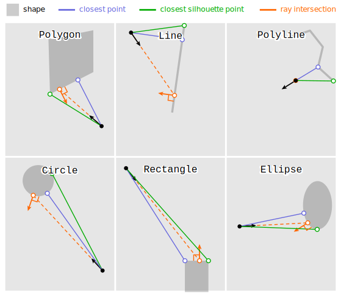

# geometric-queries

Penrose supports a rich set of _geometric queries_, i.e., quantities associated with a shape that can be inspected relative to a given query point.  This example displays the cross product of (geometric queries) x (shape types), where geometric queries include `rayIntersect`, `rayIntersectNormal`, `closestPoint`, and `closestSilhouettePoint`, and shape types include `Line`, `Polyline`, `Polygon`, `Rectangle`, `Circle`, and `Ellipse`.  It does not illustrate other available queries (such as signed distance), nor other available shapes (such as groups), which can be found in other examples.  A legend indicates the widgets used to illustrate each query type; the black dot and arrow give the query point and ray direction, respectively.  If the result of a query is empty (i.e., no ray intersection or no silhouette points), the result point is drawn at the query point.

