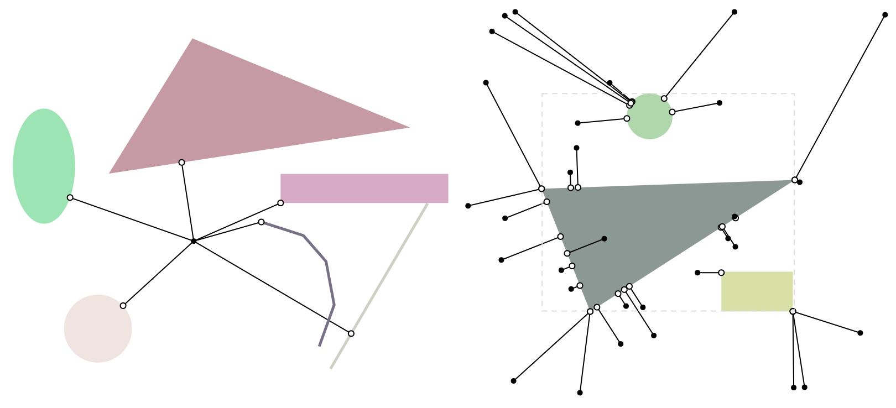

# geometric-queries/closest-point

The trios `test-closest-point` and `test-closest-point-group` test closest point queries using a random collection of shapes and query points. The former shows the point closest to each query point on each individual shape, whereas the latter shows the closest point on any shape within an aggregate shape described by a `Group`. Each query point is drawn as a black dots, and the corresponding closest point is drawn as a white dot connected by a line segment.
