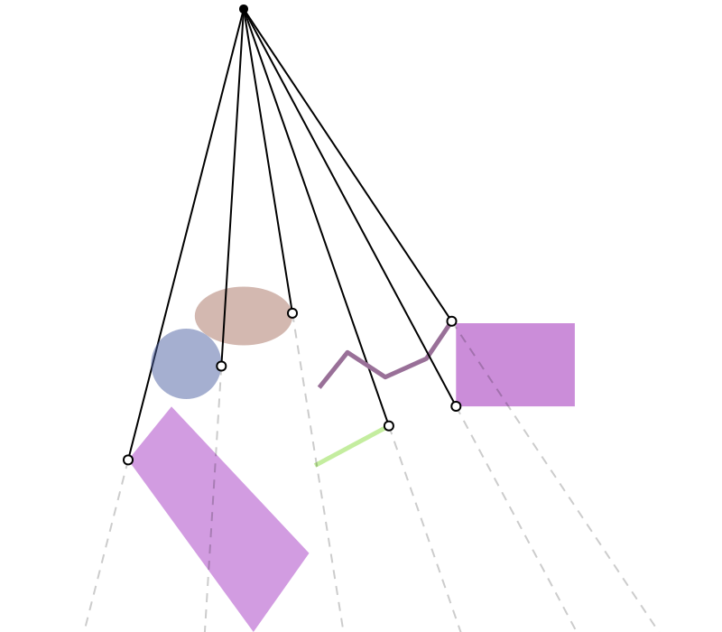

# geometric-queries/closest-silhouette-point

A _silhouette point_ on a shape is a point where the normal changes from front-facing to back-facing, relative to the location of a fixed observer or query point. The trio `test-closest-silhouette-point` tests closest silhouette point queries using a random collection of shapes and query points. The query point is drawn as a black dot, and the closest silhouette point on each shape is drawn as a white dot connected to the query point by a solid line segment. Dashed lines illustrate the corresponding _crepuscular rays_, i.e., the continuation of these segments along the direction of the visibility silhouette (see discussion in Gargallo et al, ["Minimizing the Reprojection Error in Surface Reconstruction from Images"](https://inria.hal.science/inria-00266287/file/GargalloPradosSturm-iccv2007.pdf)).
