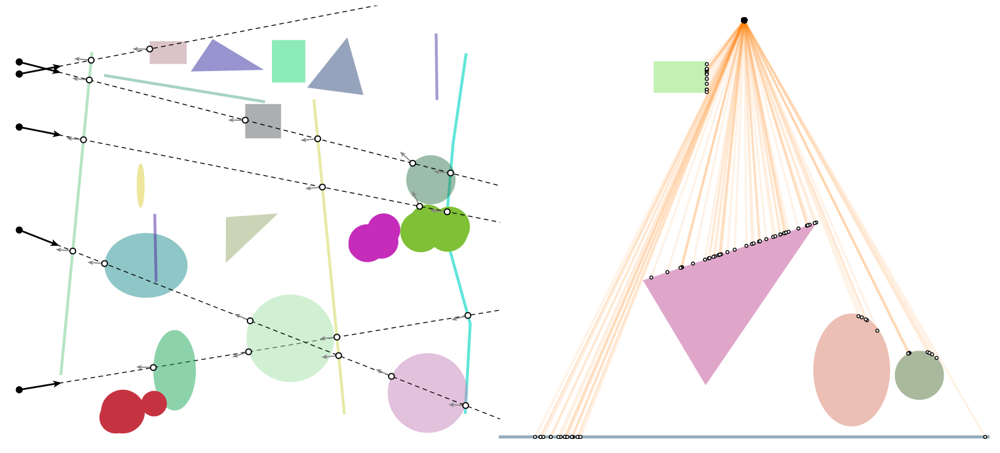

# geometric-queries/ray-intersect

The trios `test-ray-intersect` and `test-ray-intersect-group` test ray-shape intersection using a random collection of rays and shapes.  The former shows the first intersection with individual shapes, whereas the latter shows the first intersection with an aggregate shape described by a `Group`.  The `test-ray-intersect` example also plots the normal at the point of intersection.
