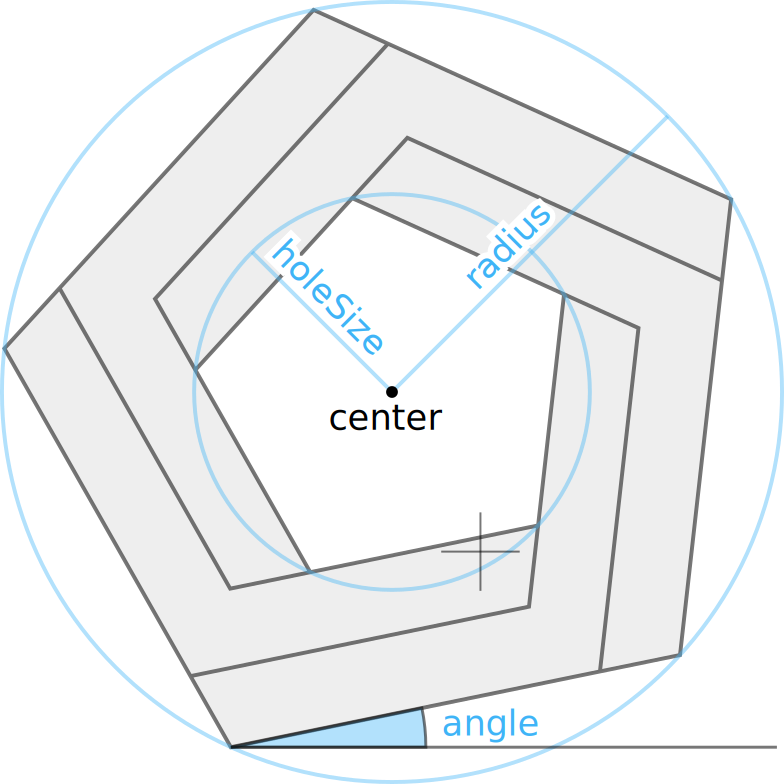

# Impossible Polygons

This example demonstrates how to use the built-in `Penrose()` function to draw the Penrose logo, or more generally, an "impossible" n-sided polygon, inspired by Roger Penrose. This logo can be used to indicate that a diagram was created in Penrose, or simply used for fun!

The `Penrose()` function takes several parameters (described below), and returns a path string that can be assigned to the `d` field of a `Path` shape. To draw multiple polygons with just a single `Path`, this path string is actually a _compound_ path, i.e., it has multiple "move to" and "close path" commands within a single string. (Contributors to the Penrose standard library may find this approach useful for drawing other standard widgets.)

## Parameters

The `Penrose()` command can be used _without_ any parameters, producing a reasonable default logo. Refinements of this basic logo can be achieved via the following parameters (in this order):

- `center` — (x,y) translation
- `radius` — radius of outer polygon (must be positive)
- `holeSize` — radius of inner polygon as a fraction of the outer radius (in range (0,1])
- `angle` — angle of rotation
- `nSides` — number of sides (integer ≥ 3)
- `chirality` — either `"cw"` for clockwise or `"ccw"` for counterclockwise

If the given value of `nSides` is less than three, it gets clamped to three (since otherwise the shape is ill-defined). The image below shows the shape generated for `nSides = 1` through `nSides = 9`, as well as the effect of the `chirality` parameter.

