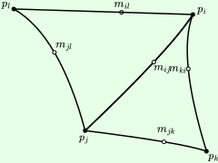

# lagrange-bases

`lagrange-bases` is a stub for a package that draws meshes made of higher-order Lagrange finite elements. Currently it supports only linear triangular and quadratic elements, because quadratic quadrilateral elements, and other higher-order elements, require so many constructor arguments that we run into the [exponential scaling bug in Style selectors](https://github.com/penrose/penrose/issues/566).

The basic idea is that `Nodes` can be connected by `Elements` of any order. The rule for elements of type `QuadraticTriangle` in `lagrange-bases.sty` serves as a nice simple example of drawing quadratic Bézier curves; note that because we use the function `interpolateQuadraticFromPoints` rather than `quadraticCurveFromPoints`, these curves interpolate the three given points (rather than using the middle point as an approximated control point). There are some other cool things we could in principle do here (like automatically restricting edges that belong to multiple elements to polynomials of the lower degree), but see again the note about the bug above, which makes it hard to use long selectors.

A basic example is shown below.

