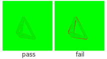

# matrix-library

This directory contains end-to-end regression tests of basic 2D and 3D matrix transformations.  Each test draws a reference solution in red; the solution computed via Penrose library functions is then drawn in green on top of the reference solution.  Since the background is also green, the test passes if the entire image is green; it fails if any part of the image is red.  Note that to avoid the impression that tests are bogus or redundant, and to provide some visualization of what is actually drawn, the computed solution is drawn in a slightly darker shade of green than the background.

**Example.** For example, here's what the `rotate3d` test will look like if the rotation matches the reference rotation (left), versus what it looks like if we use a bogus angle (right).

Testing can be automated by replacing the darker green color `#0e0` with the color `#0f0` in both `matrix-functions-2d.style` and `matrix-functions-3d.style`.  In this scenario, all pixels of the rasterized SVG should be 100% green (and 0% red, 0% blue).  Hence, tests can be checked automatically by just verifying that there are no pixels that deviate from pure green.

### Reference solutions

Reference solutions are generated in _Mathematica_, using functions that match the tested Penrose functions (e.g., `RotationMatrix[]` for `rotate3d`).  See the notebooks `Reference2D.nb` and `Reference3D.nb`.

The general strategy is to start with a shape that has no Euclidean symmetries, and apply an arbitrary transformation such that the shape (or projected shape, in the 3D case) remains inside the canvas.  The use of a shape without symmetries reduces the chances of a false positive; staying inside the canvas ensures that any differences between the reference and computed result are observed.

### Functions tested

The following functions are currently tested (others should be added if and when the library is extended):

**2D:**

- `identity2d`
- `diagonal2d`
- `inverse2d`
- `outerProduct2d`
- `skew2d`
- `shear2d`
- `translate2d`
- `scale2d`
- `rotate`
- `rotate2d`
- `matrix2d`

**3D:**

- `identity3d`
- `diagonal3d`
- `inverse3d`
- `outerProduct3d`
- `crossProductMatrix`
- `rotate3d`
- `rotate3dh`
- `scale3d`
- `shear3d`
- `translate3dh`
- `matrix3d`

To keep the size of the test set reasonable, some helper functions are not tested directly.

