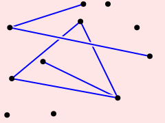

### Penrose diagrams with audio

This example is a proof-of-concept for annotating Penrose diagrams with audio. Audio annotations are potentially useful for increasing the accessibility of diagrams for, e.g., the blind or partially sighted.

The file `audio.sty` defines a simple Style that associates a sound with each dot. The file `sound-test.sub` draws some random dots and lines.

The example is implemented by taking advantage of the _SVG passthrough_ feature of Style: any shape attribute not recognized by Penrose will still be passed through and written into the SVG file. In this case, we pass through the attribute

```
onmouseover: "try { $('audio').currentTime=0; } catch(e) {} $('audio').play()"
```

which executes the given JavaScript string when the cursor hovers over the associated shape. (One could also use `onclick` here.) **Currently Penrose cannot generate a complete audio-enabled SVG file.** Additional definitions must be added to the SVG generated by Penrose that specify the audio file(s), and give mouse focus to the SVG file:

```
  <defs>
    <script>
      function $(sel) { return document.querySelector(sel); }
    </script>
    <audio xmlns="http://www.w3.org/1999/xhtml">
      <source src="pop.wav" type="audio/x-wav"/>
    </audio>
  </defs>
```

### Example

To see (and hear!) an example, download the files `penrose-sound-example.svg` and `pop.wav` to the same local directory. Open `penrose-sound-example.svg` in the Google Chrome web browser, and click on the pink background. Hovering over any black circle should now play a "pop" sound.



(Note that this example will _not_ work through the GitHub repo webpage directly.)
