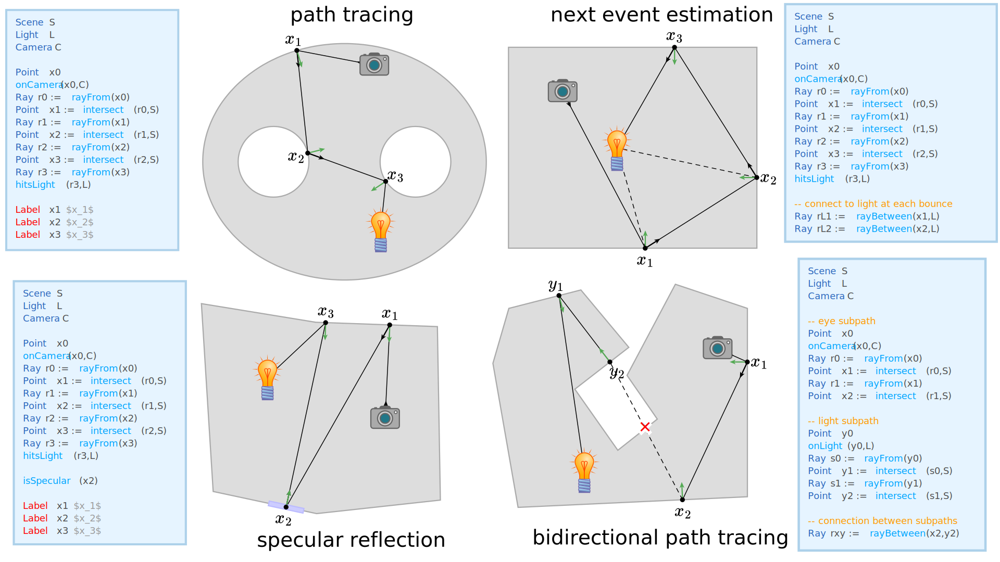

# ray-tracing

The examples in this directory show how Penrose can be used to create diagrams for rendering/light transport algorithms.  The current package is fairly simplistic, but **can easily be extended to handle a broader range of phenomena/scenarios**—take a look at the source files `ray-tracing.domain` and `ray-tracing.style`, which are not much harder to edit than CSS.  At present, there are just a few basic types:

- `Scene` — The scene geometry, which can be represented by any SVG shape (or collection of shapes).  By default, the shape is set to a fixed polygon, but see `ray-tracing.style` for more options.  Custom shapes can be imported by copying/pasting the `"points"` attribute of an SVG `<polygon>` into the `points:` field of the scene geometry (and reformatting the point coordinates).  Future versions of Penrose should (hopefully!) support direct import of SVG data for use in computation/optimization.
- `Point` — A point in the scene, typically used to represent points along a path.
- `Ray` — A ray in the scene, which has an origin and a direction.  Typically rays are used to define segments along a path.
- `Light` — A light source, typically used as the start/end of a path.  The icon used to represent a light is currently set to `lightbulb.svg`, but any other SVG (or custom, responsive drawing functions) could be used instead.
- `Camera` — A camera or eye, typically used as the start/end of a path.  The icon used to represent a camera is currently drawn with a custom function, but could be replaced with an imported SVG (or another inline function).
- `Entity` — An `Entity` is a generic type that includes `Point`, `Light`, and `Camera`, since all three of these types can correspond to points along a path.  Using `Entity` in `ray-tracing.style` makes it easier to write generic code (and avoid redundancy).

There are also just a few basic constructors:

- `rayFrom(Point p) -> Ray` — Creates a ray that originates at the point `p`.
- `rayBetween(Entity p, Entity q) -> Ray` — Creates a ray that goes from `p` to `q`.
- `intersect(Ray r, Scene S) -> Point` — Creates a point by intersecting ray `r` with the scene `S`.

And a few basic predicates:

- `onCamera(Point p, Camera C)` — Asserts that point `p` of the path is on a camera `C`.
- `onLight(Point p, Light L)` — Asserts that point `p` of the path is on a light `L`.
- `hitsLight(Ray r, Light L)` — Asserts that ray `r` hits light `L` (e.g., to terminate a path).
- `isSpecular(Point p)` — Asserts that point `p` of the path is a specular bounce.

Several examples using this package can be found in the following trios:

- `path-trace`: A basic example drawing a camera path that experiences a few diffuse reflections before hitting a light source.
- `specular-path`: The same as `path-trace`, but one of the bounces is specular.
- `bidirectional`: An example making a direct connection between short light and eye subpaths.
- `next-event-estimation`: A path tracing example where each bounce tries to make a direct connection to the light source (to reduce variance).
