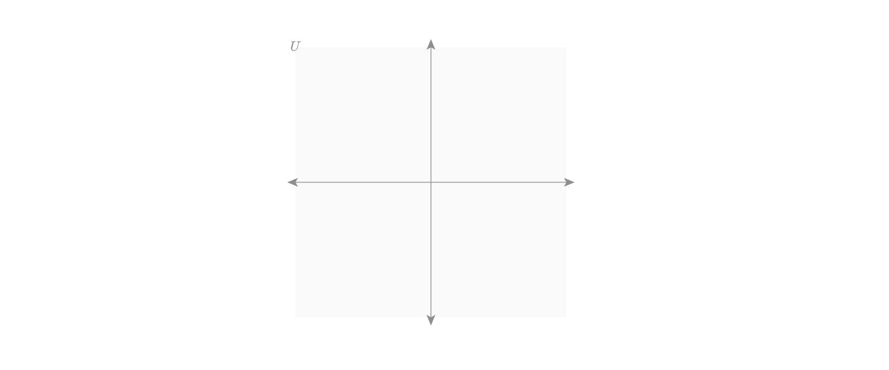

# Starter Code Walk Through
This is a supplementary document to tutorial 3, which teaches functions in Penrose. This document goes through the given starter code for the tutorial in detail.

## :runner: Starter Code Diagram

Download the [starter code here](../../code/tutorial3).


## :runner: Domain
```
type VectorSpace
type Vector
predicate In(Vector, VectorSpace V)
```
Here we have 2 types, 1 predicate. Together we will define a new function. Furthermore, we have implemented drawing a vector space for you, and together we will draw a vector in a vector space, and add two vectors.

## :runner: Substance
```
VectorSpace U
Vector v
Vector w
In(v, U)
In(w, U)
```
The substance file contains the lines for putting two vectors in the same vector space `U`. Later we will compose a new vector as the sum of the two existing vectors.

## :runner: Style

The style file is a bit more involved, therefore we provide a very detailed step through of the code. __Again, feel free to [skip to the example](https://penrose-saurus.netlify.app/docs/tutorial/functions/#task-1-vectors-in-vector-space) if you feel confident reading and comprehending the code by yourself__.

On the very top of the file, you see this block of code.

```
canvas {
  width = 800
  height = 700
}
```

`canvas.width` and `canvas.height` are special properties to specify the size of the output SVG file
that the Penrose diagram is rendered in. These values can be used to constrain other parts of your
diagram as well, for example if you want a shape to take up exactly half the width of the canvas.

Next comes a `const` namespace.

```
const {
  scalar vectorSpaceSize = 350.0
  scalar arrowheadSize = 0.7
  scalar lineThickness = 1.
  scalar arrowThickness = 1.5
  color gray = rgba(0.6, 0.6, 0.6, 1.)
  color lightBlue = rgba(0.2, 0.4, 0.8, 1.0)
  color lightGray = rgba(252, 252, 252, 0.015)
  color green = rgba(0., 0.8, 0., 1.)
  color none = rgba(0., 0., 0., 0.)
}
```
There's nothing special about the name `const`, but using a namespace is good practice for
organizing your constants in Style programs. Here we have some constants that helps with drawing out the vector
space. Feel free to add more useful constants in here for your explorations. Also note how Penrose
has built-in `scalar` and `color` types for `.sty` programs for your readability.

The real fun starts! 🥁 To draw a vector space, we have a background, an origin, x-axis and y-aixs.

* __Background__
  ```
  U.background = Rectangle {
      center : U.origin
      width : const.vectorSpaceSize
      height : const.vectorSpaceSize
      fillColor : const.lightGray
      strokeColor : const.none
  }
  ```
  The background is a simple square :white_large_square:. Feel free to add a new constant to the `const` object and assign a new color to the background.

* __Origin__
  ```
  scalar axisSize = const.vectorSpaceSize / 2.0
  vec2 U.origin = (0., 0.)
  vec2 o = U.origin /* just so we don't need to type U.origin everytime */
  U.axisColor = const.gray
  ```
  For any vector space, we need an origin, and everything else will be centered on the origin.

* __Axis__

  The x-axis and y-axis have each of their center on the origin of the vector space, and extends out to opposing directions. It follows that their length is half of the length of vector space (which is a square).

  An axis is a line with arrowheads on both ends. As defined by the code above, `axisSize = const.vectorSpaceSize / 2.0`, and the center of the axis line is at the origin. Therefore we have the start `x` value as the origin's `x` with the axis size subtracted, and the end `x` value as the origin's `x` with the axis size added.

  ```
  U.xAxis = Line {
      start : (o[0] - axisSize, o[1])
      end : (o[0] + axisSize, o[1])
      strokeWidth : const.lineThickness
      style : "solid"
      strokeColor : U.axisColor
      startArrowhead: true
      endArrowhead: true
      arrowheadSize : const.arrowheadSize * 2.
  }
  ```

  Refer to [here](https://penrose-saurus.netlify.app/docs/api/shapes/line) for more information on the line shape.

* __Label__
  ```
  U.text = Equation {
      string : U.label
      center : (U.origin[0] - axisSize, U.origin[1] + axisSize)
      fillColor : U.axisColor
  }
  ```
  Lastly we just have some styling on the label. That's it! :cartwheeling:

Now you are ready to add and draw some vectors. [Continue with the tutorial here.](https://penrose-saurus.netlify.app/docs/tutorial/functions/#task-1-vectors-in-vector-space)
