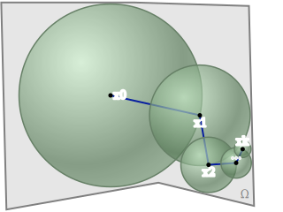
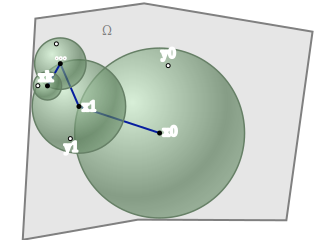
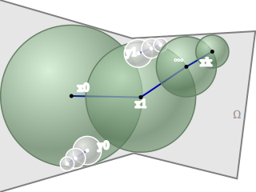
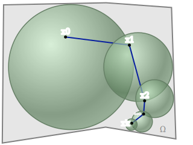

# walk-on-spheres

This package can be used to draw diagrams that illustrate steps of the _walk on spheres (WoS)_ algorithm,
replicating the style used in the papers

- Sawhney & Crane, ["Monte Carlo Geometry Processing"](http://www.cs.cmu.edu/~kmcrane/Projects/MonteCarloGeometryProcessing/index.html) (SIGGRAPH 2020)
- Sawhney, Seyb, Jarosz, Crane, ["Grid Free Monte Carlo for PDEs with Spatially-Varying Coefficients"](https://cs.dartmouth.edu/wjarosz/publications/sawhneyseyb22gridfree.html) (SIGGRAPH 2022)

As in the actual WoS algorithm, sequences of spheres in a walk may overlap significantly. While overlap accurately represents the behavior of the algorithm, it also often makes randomly-generated diagrams difficult to read. The top of each example `.sub` files gives a `variation` string for a diagram with little overlap, but a nice improvement to this package would be to add some additional `ensure`/`encourage` statements to help reduce the amount of overlap.

#### Domain

As in WoS, steps of the walk are described by expressing how they were sampled, e.g., from the boundary or interior of the ball around the current point. Currently there are two basic types: a `Step` represents a step in a walk, and a `Sample` represents a point used to estimate an integral, but which may not itself be used as the start of a new walk (e.g., a sample of the fixed source term in a Poisson equation). The predicate `isNested` can be used to highlight steps that belong to a recursive invocation of WoS, i.e., a "walk within a walk." By default, the package assumes on-center walks (i.e., steps are placed at the center of each ball); the predicate `isOffCenter` can be used to describe an off-centered walk.

#### Style

As noted above, the main style file (`walk-on-spheres.sty`) has been written to replicate the visual style of existing papers, but can easily be modified/customized. The shading of each ball is determined by the file `ball.svg`, and steps from different types of walks are colored by drawing a semi-transparent disk on top of this shading image. More significant customizations might include, e.g., drawing rectangles rather than spheres for the _walk on rectangles_ algorithm. See comments in the `.sty` file for further details.

Note that by default, labels are currently drawn using `Equation` shapes (which are typeset through MathJax) rather than the richer `Text` object (which are typeset via SVG text and supports outlines and nicer fonts, as shown below). There is a superficial reason for using this default: [registry regressions](https://github.com/penrose/penrose/wiki/Registry) on the Penrose GitHub repository may be run on different plaforms (e.g., Mac vs. Linux), and there are small cross-platform differences in the way SVG text is rendered, sometimes causing regressions to fail. If you want the nicer text, just comment out instances of `Equation` in `walk-on-spheres.sty`, and uncomment the corresponding `Text` shapes directly below them. (For this reason, the default diagrams will also not look like the previews shown below, e.g., text will not have white outlines.)

#### Substance

The `.sub` examples show how to illustrate estimators for basic Laplace, Poisson, and nested equations, but the package could easily be extended to accommodate other use cases, as discussed above.

`Laplace.sub`

`Poisson.sub`

`Nested.sub`

`OffCenter.sub`

