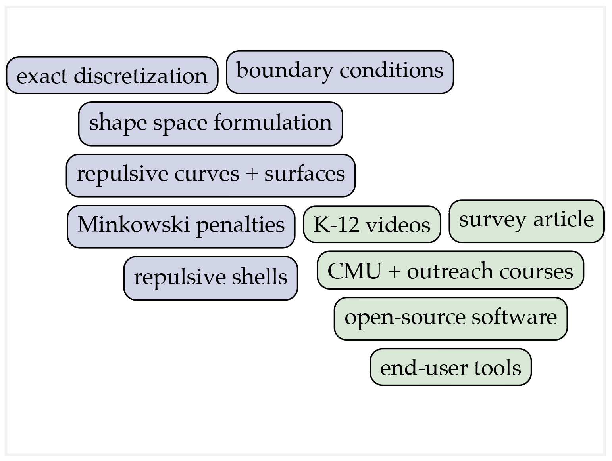

## Simple Word Cloud

This example shows how to create a simple "word cloud" in Penrose, i.e., a loose arrangement of concepts nicely packed into a figure of a target size. In particular, it illustrates how to do a few basic things in Style:

- Draw styled text, using a particular font family, size, etc.
- Draw a rectangle that nicely bounds a piece of text.
- Ensure that text boxes do not overlap each-other.
- Encourage text boxes of the same type to appear near each-other on the canvas.

The Domain/Style are in `word-cloud.[domain|style]`, and an example Substance program is in `example.substance`.

#### Example

