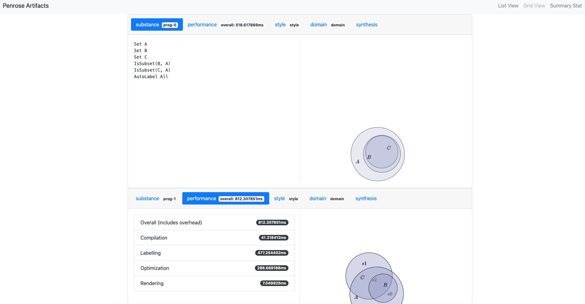

# `@penrose/roger`: a headless renderer for Penrose

This package is a command-line application that depends on `@penrose/core` and batch-processes multiple Penrose diagrams.

Usage:

```
roger [command]

Commands:
  roger trio [trio..]                Generate a diagram from a Penros
                                     e trio.
  roger batch <registry> <out>       Generate diagrams from a registr
                                     y of Penrose trios.
  roger watch                        Watch the current folder for fil
                                     es & changes (must end in .sub,.
                                     substance,.sty,.style,.dsl,.doma
                                     in)
  roger shapedefs                    Generate a JSON file that contai
                                     ns all shape definitions in the
                                     Penrose system.
  roger textchart <artifacts> <out>  Generate an ASCII chart that sho
                                     ws the performance data.

Options:
  --version  Show version number                            [boolean]
  --help     Show help                                      [boolean]

```

## Getting started

- Follow the instruction in the [wiki page](https://github.com/penrose/penrose/wiki/Building-and-running) to install Penrose.
- Run `yarn start batch registry.json out/ --path=../examples/src/` in this directory. The output SVGs will appear in `out`.

## Using `roger` for local development

- If you are developing a module in `core` (e.g. `Synthesizer`), you can run `yarn start` in the project root direcory, which will continuously watch your changes in `core` and update your build.
- Check the console before you run `roger` to make sure your changes in `core` are not causing any errors.
- If the build is successful, `roger` will now be using the most recent version of `core` when batch-processing Penrose programs.

## Static site generation

In addition to batch-processing Penrose programs, you can also use `roger` to generate a static site for viewing the diagrams and metadata (e.g. performance statistics). Here's an example:

- Run `yarn start batch registry.json out --path=../examples/src/ --folders` in this directory.
  - Different from the example above, the `--folders` option asks `roger` to output metadata along with SVGs. `roger render` requires the output to have associated metadata.
- Run `yarn start render out browser` to generate a static site.
- Open `browser/index.html` to view the result.


