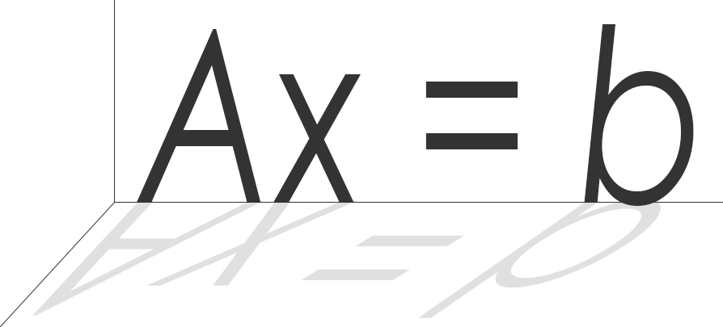

<a href="https://rohan-sawhney.github.io/linear-algebra-js/">

</a>

# About

linear-algebra-js is an optimized linear algebra library in pure Javascript. It supports
both sparse and dense matrices, with routines to compute Cholesky, LU, and QR factorizations.

linear-algebra-js is implemented in [asm.js](http://asmjs.org) to obtain the best possible
performance for a Javascript program, and was compiled from a wrapper around the
C++ library [Eigen](https://eigen.tuxfamily.org) with [emscripten](http://emscripten.org). Future updates will compile the more optimized
sparse matrix library [Suitesparse](http://faculty.cse.tamu.edu/davis/suitesparse.html) to asm.js.

Detailed documentation and unit tests can be found in the docs and tests directories
of this [repository](https://github.com/rohan-sawhney/linear-algebra-js).

## Code Snippet

```
// solve the linear system Ax = b, where A is a square sparse matrix
let A = SparseMatrix.identity(5, 5);
let b = DenseMatrix.ones(5, 1);

let lu = A.lu();
let x = lu.solveSquare(b);

b.scaleBy(5);
x = lu.solveSquare(b); // factorization is reused
```

## Getting started

1. Clone this repository
```
git clone https://github.com/rohan-sawhney/linear-algebra-js.git
```

2. Include the files in the src directory in your browser or node js code.

## Author

[Rohan Sawhney](http://rohansawhney.io)

## License

[MIT](https://opensource.org/licenses/MIT)
